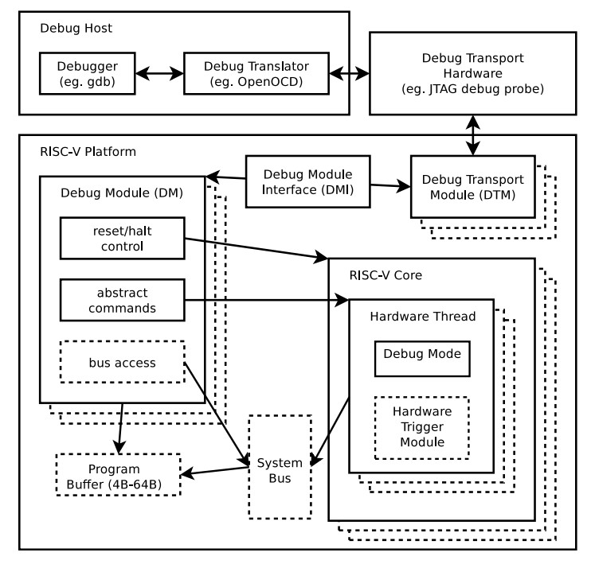
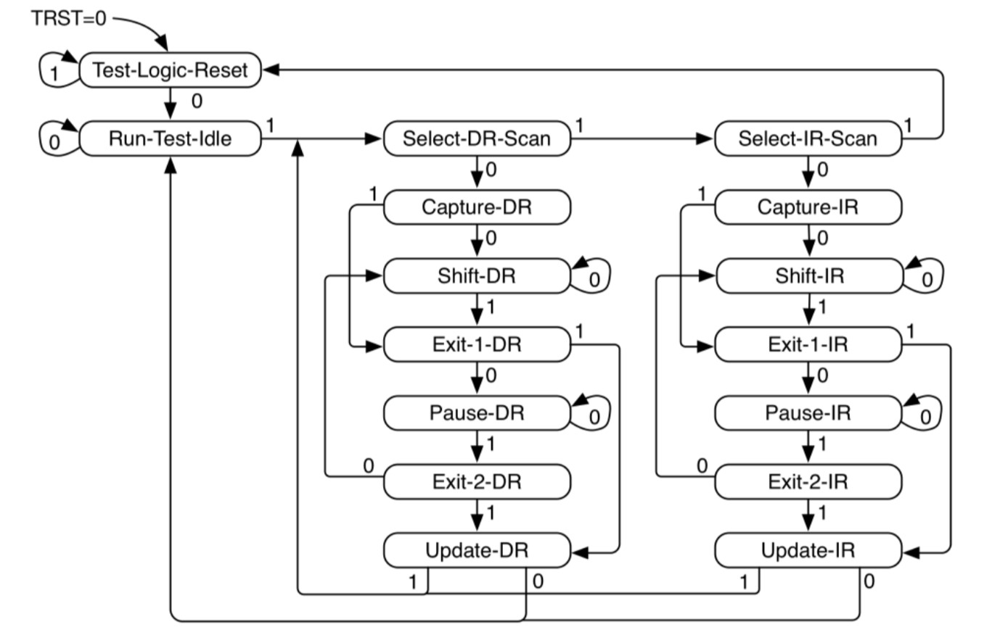
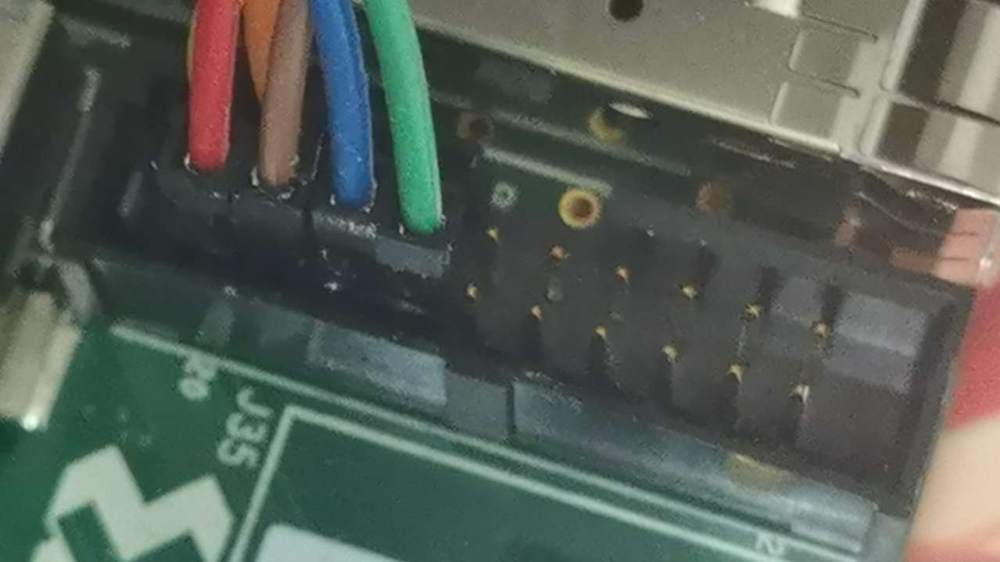

sycuricon( 四 ): debug module
=======================================

在仿真的环境里对处理器进行调试是相对比较简单的，通过插桩、打印、SVA、波形 dump 等技术，我们可以很方便地得到处理器内部的状态信息，但是一般我们综合下板或者做成芯片就很难得到处理器的内部状态了。

另外当我们综合下板或者流片的处理器在执行软件的时候，如果没有额外的调试手段，一旦因为软硬件异常启动失败或者没有任何反应，我们也没有办法推测处理器内部的情况进而定位错误的位置。

因此在处理器内部继承额外的调试模块，可以在处理器出现故障的时候作为最后一道保险，通过硬件支持的调试模块对处理器内部的软硬件故障进行排除。

RISCV 定义了一套完整用于调试的 debug module 体系结构，并且 rocket-chip 等处理器实现了 debug module，RISCV 社区也提供了 openocd 等调试软件。因此我们也在 riscv-spike-sdk 和 starship 中集成了调试模块软件、硬件和综合、仿真流程。本文我们将对这些部分进行详细介绍。

debug module
~~~~~~~~~~~~~~~~~~~~~~~~~~~~~~~~~

我们首先来介绍一下 RISCV 体系结构定义的 debug module，其整体的架构图如下。

芯片的 debug module 一般向外暴露一个 jtag 接口，用 jtag 信号传输协议进行线路传输。一个 jtag 信号线由四根线路组成，分别是：

* tclk：负责为 debug module 提供时钟信号
* tms：负责控制 debug module 内部的 FSM 进行状态转移
* tdi：负责向 debug module 发送数据和命令
* tdo：负责传输来自 debug module 内部的数据

调试的 host 内一般用 gdb 进行程序的调试，gdb 首先将调试命令发送给 openocd 软件，openocd 软件将抽象命令转化为 jtag 线路可以接受的 01 信号发送给 debug module。

熟悉 gdb 的朋友都知道，调试功能是很复杂的，包括但不限于打断点、读写任意寄存器、读写内存、单步调试等等。作为硬件支持的调试模块，debug module 具有如下调试功能：

* 读写任意通用寄存器
* 读写任意特权寄存器
* 通过处理器端或者总线直接读写任意内存
* 打代码断点
* 打内存读写断点

DM（debug module）包含一组复杂的寄存器，可以通过 jtag 线路对这些寄存器进行配置，进而实现上述对处理器的调试。我们可以简单介绍部分的寄存器地址和功能：

* 0x04-0x0f，data：用于 host 和 core 之间的 message 数据交换
* 0x10，dmcontrol：控制各个 hart 的状态，比如挂起、执行等等
* 0x11，dmstatus：表示 hart 的状态
* 0x17，command：传递控制命令，包括读写寄存器、读写内存等
* 0x20-0x2f，probuf：program buffer，用于写一些小型的程序执行片段

可以看到 debug module 内部的寄存器配置很复杂，但是 jtag 的信号输入输出很复杂，因此需要 DTM（debug transport module）进行两部分间的数据转换。

DTM 内置一个 FSM、一个 IR 寄存器和一个 DR 寄存器。JTAG 的 TCLK 信号为这个有限状态机提供时钟驱动，TMS 信号控制有限状态机的状态转移，TDI 信号提供信号输入，TDO 信号提供信号输出。
通过 TMS 对 FSM 进行状态转移，然后通过串并行转换利用 TDI、TDO 对 IR、DR 进行读写，然后读写 DM 的寄存器，读阶段 ``DR = DM[IR]``，写阶段 ``DM[IR]=DR``。
这里我们可以将 DM 的寄存器序列类比为 memory，IR 类比为 MAR，DR 类比 MDR。

我们假设现在想要执行寄存器读的命令，我们的 JTAG 可以进行如下的数据传输：
* 首先 FSM 位于 Run-Test-Idle 状态
* TMS 输入 1100，进入 Select-IR-Scan、Capture-IR、Shift-IR 状态，可以修改 DTM 中的 IR 寄存器
* 执行寄存器读需要对 command 寄存器写入对应的命令，所以 TMS 输入 0， TDI 依次输入 command 的编号 0x17，通过位移操作和串并行转换，让 IR 载入 0x17 的值
* 之后 TMS 输入 11，进入 Exit-1-IR、Update-IR 状态，正式修改 IR 寄存器的值为 0x17。
* TMS 输入 100，进入 Select-DR-Scan、Captre-DR、Shift-DR，可以通过位移修改 DR
* TMS 输入 0，TDI 输入对应的 command 命令的 0、1，通过位移写 DR 寄存器
* 之后 TMS 输入 11，进入 Exit-1-DR、Update-DR，更新 DR 寄存器
* 之后 DM[IR] 也就是 command 寄存器载入 DR 的值，也就是读寄存器的命令
* Shift-DR 除了将 TDI 写入 DR，还会将 DR 写入 TDO，从而通过串并行转换，将 DM 中的寄存器的值通过 TDO 返回 host

DTM 和 DM 之间还有一个 DMI（debug module interface），它的功能类似于总线，IR 提供地址信号、DR 提供数据信号、FSM 提供控制信号，来读写 DM 中的寄存器。

spike 的 jtag 调试使用
~~~~~~~~~~~~~~~~~~~~~~~~~~~~~~~~~~~~

spike 模拟器也实现了 jtag 模块，我们首先来介绍如何对 spike 模块进行 jtag 的调试。虽然 spike 自己提供了调试交互界面，但是通过 jtag、openocd 可以对 spike 运用 gdb 调试，调试的效果会更好；其次通过学习模拟器的调试，可以为后续学习硬件 jtag 调试进行铺垫。

spike 启动调试功能
-------------------------------------

通过 spike 的命令行操作 ``spike -H --rbb-port=9824 elf`` 可以调用 spike 的 jtag 接口。

* -H：表示 spike 载入 elf 之后不马上启动，而是等待调试程序的连接
* spike 内部会启动一个 remote_bitbang 模块，这个模块会启动一个 TCP 连接
* --rbb-port=9824：指示 remote_bitbang 模块的 TCP 连接的 port 号是 9824，当然也可以是别的，但是习惯用这个
* 之后我们可以用 openocd 连接 9824 端口，然后用 TCP 连接向 remote_bitbang 发送调试命令
* remote_bitbang 会将 TCP 连接接受的调试命令转化为 jtag 格式驱动 debug module 工作；将 debug module 返还的 jtag 信号转换为 openocd 数据格式，用 TCP 连接发送给 openocd。

.. code-block:: sh

    riscv-spike-sdk$ ./toolchain/bin/spike -H --rbb-port=9824 ./build/riscv-pk/bbl
    Listening for remote bitbang connection on port 9824.

openocd 连接
-----------------------------

我们在 riscv-spike-sdk 中集成了 openocd 子模块、编译脚本和调试脚本，这部分内容我们特意留到这个调试专题进行介绍。openocd 用于向 debug module 发送调试命令，一般来说它被用于 gdb 和 jtag 之间的桥梁，将调试命令在 gdb 数据包和 jtag 的 01 信号之间进行转换。

.. code-block:: Makefile

    openocd_srcdir := $(srcdir)/riscv-openocd
    openocd_wrkdir := $(wrkdir)/riscv-openocd
    openocd := $(toolchain_dest)/bin/openocd

* repo/riscv-openocd：专门用于 riscv 指令集调试的 openocd 的源代码
* build/riscv-openocd：编译 openocd 的工作区
* toolchain/bin/openocd：编译之后安装的 openocd 工具

.. code-block:: Makefile

    $(openocd): $(openocd_srcdir)
        rm -rf $(openocd_wrkdir)
        mkdir -p $(openocd_wrkdir)
        mkdir -p $(dir $@)
        cd $(openocd_srcdir) && $</bootstrap
        cd $(openocd_wrkdir) && $</configure \
            --enable-remote-bitbang \
            --prefix=$(dir $(abspath $(dir $@)))
        $(MAKE) -C $(openocd_wrkdir)
        $(MAKE) -C $(openocd_wrkdir) install
        touch -c $@
    
    .PHONY: openocd
    openocd: $(openocd)

执行 ``make openocd`` 可以对 openocd 进行编译，首先用 bootstrap 和 configure 进行编译的配置生成，然后执行 make 和 make install 进行编译和安装。需要注意的是后，configure 执行的时候需要额外带 --enable-remote-bitbang 选项，这样编译得到的 openocd 才支持 remote_bitbang 连接。

执行完毕后执行如下命令即可开始调试。这里的 log 就是 openocd 成功通过 remote_bitbang 连接到了 debug module，然后输出 debug module 内部 probe 的配置，之后开放 3333 端口供 gdb 远端调试。

.. code-block:: sh

    riscv-spike-sdk$ ./toolchian/bin/openocd -f conf/spike.cfg 
    Open On-Chip Debugger 0.12.0+dev-g4559b4790 (2023-12-14-15:22)
    Licensed under GNU GPL v2
    For bug reports, read
            http://openocd.org/doc/doxygen/bugs.html
    Info : only one transport option; autoselecting 'jtag'
    Info : Initializing remote_bitbang driver    
    Info : Connecting to localhost:9824
    Info : remote_bitbang driver initialized  
    # 连接并初始化 remote_bitbang

    Info : Note: The adapter "remote_bitbang" doesn't support configurable speed
    # remote_bitbang 对配置的传输速度不支持，不过反正是仿真，无所谓

    Info : JTAG tap: riscv.cpu tap/device found: 
    0xdeadbeef (mfg: 0x777 (<unknown>), part: 0xeadb, ver: 0xd)
    Warn : JTAG tap: riscv.cpu       UNEXPECTED: 
    0xdeadbeef (mfg: 0x777 (<unknown>), part: 0xeadb, ver: 0xd)
    Error: JTAG tap: riscv.cpu  expected 1 of 1: 
    0x10e31913 (mfg: 0x489 (SiFive Inc), part: 0x0e31, ver: 0x1)
    Error: Trying to use configured scan chain anyway...
    Warn : Bypassing JTAG setup events due to errors
    # 检查 debug module 的版本号，版本号不一致其实也无所谓

    Info : [riscv.cpu] datacount=2 progbufsize=2 
    # 检查 debug module 内部的配置，这里就是内部 data 寄存器、probuf 寄存器的个数

    Info : [riscv.cpu] Examined RISC-V core; found 1 harts
    Info : [riscv.cpu]  XLEN=64, misa=0x800000000014112d
    [riscv.cpu] Target successfully examined.    
    # 检查体系结构配置，发现指令集是 RISCV，只有一个 core，64位，支持的指令集扩展如 MISA
    
    Info : starting gdb server for riscv.cpu on 3333
    Info : Listening on port 3333 for gdb connections
    Info : Listening on port 6666 for tcl connections
    Info : Listening on port 4444 for telnet connections
    # 位 gdb、tcl、telnet 连接调试提供端口

conf/spike.cfg 是用于 openocd 对 spike 进行调试的配置，其内容如下，部分 field 的介绍如下：

* interface：openocd 连接的端口的类型，这里是 remote_bitbang
* remote_bitbang_host、remote_bitbang_port：连接的 remote_bitbang 的 TCP:IP 地址，所以其实也可以上网调试
* -irlen：IR 的长度
* -expected-id：期待读到的 debug module 的版本号，不设置也可以

.. code-block:: text

    interface remote_bitbang
    remote_bitbang_host localhost
    remote_bitbang_port 9824

    set _CHIPNAME riscv
    jtag newtap $_CHIPNAME cpu -irlen 5 -expected-id 0x10e31913

    set _TARGETNAME $_CHIPNAME.cpu
    target create $_TARGETNAME riscv -chain-position $_TARGETNAME

    gdb_report_data_abort enable

    init
    halt

gdb 连接
--------------------------------

现在执行 gdb 连接调试。首先需要使用和执行的程序一致的 gdb，比如程序使用 riscv64-unknown-linux-gnu-toolchain 编译得，那么请使用 riscv64-unknown-linux-gnu-gdb；用 riscv64-unknown-elf-toolchain 编译的请使用 riscv64-unknown-elf-gdb。不然可能会在调试的时候出现一些 elf 解析的问题（这纯粹是调试工具一段的问题，和处理器一段没有关系）。

通过 ``target remote: 3333`` 连接 openocd 的端口，然后就可以像调试普通的程序一样，用 gdb 对 spike 内部的程序进行调试了。

.. code-block:: sh

    starship-regvault-sdk$ ./toolchain/bin/riscv64-unknown-linux-gnu-gdb ./build/riscv-pk/bbl
    GNU gdb (GDB) 13.2
    Copyright (C) 2023 Free Software Foundation, Inc.

    ...
    
    (No debugging symbols found in ./build/riscv-pk/bbl)
    (gdb) target remote : 3333
    Remote debugging using : 3333
    0x0000000000001000 in ?? ()
    (gdb) b *0x80000000
    Breakpoint 1 at 0x80000000
    (gdb) c
    Continuing.

    Breakpoint 1, 0x0000000080000000 in reset_vector ()
    (gdb) i r pc
    pc             0x80000000       0x80000000 <reset_vector>
    (gdb) i r a0
    a0             0x0      0
    (gdb) 

debug_rom
--------------------------------

当我们用 gdb 连接 spike 之后，如果我们的 gdb 没有执行任何命令，程序卡在那里不执行，这个时候处理器内部是什么情况？我们现在在 spike 中执行 ctrl+C 可以进入 spike 的调试界面，然后可以看到处理器的执行流如下：

.. code-block:: sh

    core   0: 0x0000000000000814 (0xf1402473) csrr    s0, mhartid
    core   0: 0x0000000000000818 (0x10802023) sw      s0, 256(zero)
    core   0: 0x000000000000081c (0x40044403) lbu     s0, 1024(s0)
    core   0: 0x0000000000000820 (0x00147413) andi    s0, s0, 1
    core   0: 0x0000000000000824 (0x02041463) bnez    s0, pc + 40
    core   0: 0x0000000000000828 (0xf1402473) csrr    s0, mhartid
    core   0: 0x000000000000082c (0x40044403) lbu     s0, 1024(s0)
    core   0: 0x0000000000000830 (0x00247413) andi    s0, s0, 2
    core   0: 0x0000000000000834 (0x02041863) bnez    s0, pc + 48
    core   0: 0x0000000000000838 (0x10500073) wfi
    core   0: 0x000000000000083c (0xfd9ff06f) j       pc - 0x28

这说明当我们的处理器进入调试模式之后，控制流会陷入 0x800 内部的一块内存区域，然后在里面执行一些循环，等待外部的执行命令，然后继续执行程序。这部分代码可以参见 repo/riscv-isa-sim/debug_rom/debug_rom.S。

当 debug module 中断程序，或者程序遇到 ebreak 之后会陷入到这个 0x800 的地址，执行具体的汇编指令在这里。这里通过 MMIO，处理器软件和 debug module 之间进行信号的传输，需要注意，因为是 MMIO，访问一个地址的行为并不等同与访问一个寄存器或者内存，也许只能读到部分 bit、也许读到的是某个组合电路的返回结果。

.. code-block:: asm

	entry_loop:
        csrr s0, CSR_MHARTID
        sw   s0, DEBUG_ROM_HALTED(zero)
        lbu  s0, DEBUG_ROM_FLAGS(s0) // 1 byte flag per hart. Only one hart advances here.
        andi s0, s0, (1 << DEBUG_ROM_FLAG_GO)
        bnez s0, going

        csrr s0, CSR_MHARTID
        lbu  s0, DEBUG_ROM_FLAGS(s0) // multiple harts can resume  here
        andi s0, s0, (1 << DEBUG_ROM_FLAG_RESUME)
        bnez s0, _resume
        wfi
        jal  zero, entry_loop

* 首先将自己的 mhartid 读出写入到 0x100 地址当中，从而告诉 debug module 当前程序的 hart id
* 用 lbu 访问 0x1000 地址，从 debug module 中获得但前 hart 的 go、resume 等状态
* 访问 GO FLAG 对应的 bit，如果是被设置了就跳转到 going 部分读取返回地址，然后跳转到特殊地址
* 返回 RESUME FLAG，如果对应的 bit 被关闭，说明可以继续执行（例如遇到 c 命令），跳转到 resume，然后 dret 返回执行
* 如果都不是就不断轮询

这里 gdb 通过 jtag 修改 debug module 中的 go、resume 等 flag；处理器通过循环检查 go、resume 来获知 gdb 的请求，然后进行执行。这部分代码和 debug module 实现了一个调试命令传输的桥梁和中转站。

starship 仿真的 jtag 调试
~~~~~~~~~~~~~~~~~~~~~~~~~~~~~~~~~~~~~~~~

在 spike 模拟器中，spike 的 debug module 是软件模拟的，然后通过 remote_bitbang 软件模块和 openocd 连接。现在我们介绍硬件实现的 debug module 如何进行调试使用。

rocket-chip 的 debug module
------------------------------------

我们的 starship 处理器可以通过配置增加 debug module，我们将 conf/build.mk 的配置修改为：

.. code-block:: text

    STARSHIP_CORE   ?= Rocket
    STARSHIP_FREQ   ?= 100
    STARSHIP_TH     ?= starship.asic.TestHarness
    STARSHIP_TOP    ?= starship.asic.StarshipSimTop
    STARSHIP_CONFIG ?= starship.asic.StarshipSimDebugConfig

可以看到 StarshipSimDebugConfig 在 StarshipSimConfig 的基础上多了一行 ``WithJtagDTM``；StarshipSimTop 多了一行 ``with HasPeripheryDebug``。从而让 Starship 内部增加并且连接了 debug module。

.. code-block:: text

    class StarshipSimDebugConfig extends Config(
        new WithPeripherals ++
        new WithJtagDTM ++
        new WithClockGateModel() ++
        new StarshipBaseConfig().alter((site,here,up) => {
            case PeripheryBusKey => up(PeripheryBusKey, site).copy(dtsFrequency = Some(site(FrequencyKey).toInt * 1000000))
            /* timebase-frequency = 1 MHz */
            case DTSTimebase => BigInt(1000000L)
        })
    )

    class StarshipSimTop(implicit p: Parameters) extends StarshipSystem
        with CanHaveMasterAXI4MemPort
        with CanHaveSlaveAXI4Port
        with HasAsyncExtInterrupts
        with HasPeripheryUART
        with HasPeripheryDebug
        with CanHavePeripheryMagicDevice
    {
        val chosen = new DeviceSnippet {
            def describe() = Description("chosen", Map(
            "bootargs" -> Seq(ResourceString("nokaslr"))
            ))
        }

        override lazy val module = new StarshipSimTopModuleImp(this)
    }

之后我们对 Testharness 进行修改，将 debug module 和外围连接起来。以下仅展示 debug module 相关的部分，首先 reset 信号和 debug 模块的 reset 信号或起来，让 debug module 可以复位处理器；其次 ``Debug.connectDebug`` 函数将 dut 的 debug module 相关的接口和一些外部连接连接起来，然后将 jtag 信号和一个模拟的 remotebitbang 模块连接起来。

.. code-block:: text

    class TestHarness()(implicit p: Parameters) extends Module {

        val ldut = LazyModule(new StarshipSimTop)
        val dut = Module(ldut.module)

        // Allow the debug ndreset to reset the dut, but not until the initial reset has completed  
        dut.reset := (reset.asBool | ldut.debug.map { debug => AsyncResetReg(debug.ndreset) }.getOrElse(false.B)).asBool

        Debug.connectDebug(ldut.debug, ldut.resetctrl, ldut.psd, clock, reset.asBool, WireInit(false.B))
    }

debug module 外部连接
---------------------------

现在我们进行仿真的 verilog 生成、打 patch 等操作。我们来看一下最后生成的 testharness 代码的区别，这些区别都是 ``Debug.connectDebug`` 带来的。

首先我们的处理器多了一堆 debug 相关的接口，这些接口是各种时钟、复位、版本信号，以及 debug module 暴露的 jtag 接口。

.. code-block:: verilog

    StarshipSimTop ldut ( // @[repo/starship/src/main/scala/asic/SimTop.scala 49:19]
        .clock(ldut_clock),
        .reset(ldut_reset),
        .resetctrl_hartIsInReset_0(ldut_resetctrl_hartIsInReset_0),
        .debug_clock(ldut_debug_clock),
        .debug_reset(ldut_debug_reset),
        .debug_systemjtag_jtag_TCK(ldut_debug_systemjtag_jtag_TCK),
        .debug_systemjtag_jtag_TMS(ldut_debug_systemjtag_jtag_TMS),
        .debug_systemjtag_jtag_TDI(ldut_debug_systemjtag_jtag_TDI),
        .debug_systemjtag_jtag_TDO_data(ldut_debug_systemjtag_jtag_TDO_data),
        .debug_systemjtag_jtag_TDO_driven(ldut_debug_systemjtag_jtag_TDO_driven),
        .debug_systemjtag_reset(ldut_debug_systemjtag_reset),
        .debug_systemjtag_mfr_id(ldut_debug_systemjtag_mfr_id),
        .debug_systemjtag_part_number(ldut_debug_systemjtag_part_number),
        .debug_systemjtag_version(ldut_debug_systemjtag_verison),
        .debug_ndreset(ldut_debug_ndreset),
        .debug_dmactive(ldut_debug_dmactive),
        .debug_dmactiveAck(ldut_debug_dmactiveAck),

现在我们介绍一下这部分 debug、jtag 线路的核外连接情况，对应的电路图如下：

* 对于 jtag_TCK、jtag_TMS、jtag_TDI、jtag_TDO、jtag_TDO_driven 信号和 SimJTAG 连接，用于模拟 JTAG 信号的发送模块
* mfr_id、part_number、verison 信号的值并不重要，直接填 0 即可
* 所有模块的时钟信号都是用外部输入的 io_clock 信号，这个信号用于各个 sync 模块和处理器的 clock 信号
* debug_ndreset 信号用 io_reset 同步后和 io_reset 或起来作为处理器的 reset，这样 debug 模块和 reset 信号就可以共同复位处理器了
* io_debug_reset 是和 io_reset 独立的复位信号，io_debug_reset 的复位完成必须早于 io_reset，可以用一个上电复位模块实现
* debug_systemjtag_reset 用 io_debug_reset 实现
* io_debug_reset 同步后取反作为 debug_reset，这个 debug_reset 作为 debug module 其他模块的 reset
* debug_dmactive 同步之后作为 debug_dmativeAck 返回，同步的复位信号使用 debug_reset
* clock 经 debug_dmactive 作为控制信号的门控时钟作为 debug_clock，如果 debug_dmactive==0，debug_clock 就是 0，debug module 不工作
* debug module 中的 DMI、DM 使用 debug_clock 作为控制时钟，和 core 的其它模块是一样的时钟频率（debug clock 和 clock 同源）；DTM 则使用 jatg_TCK 作为驱动时钟

.. code-block:: text

    io_clock--------------------------------------------------------------->clock
                                                                       
                +---------------------------+                       
                |                           |                
                |   +-------+               +-------+----+          
                |   |       |                       | or |---------------+-->reset
    io_reset----+-->|       |               +-------+----+               |
                    |       |               |                            +-->resetctrl_hartIsInReset_0
        +---------->|       |---------------+
        |           +-------+    sync_debug_ndreset
        |       debug_ndreset_sync
        |
        +-------------------------------------------------------------------debug_ndreset
    
    io_debug_reset------+-------------------------------------------------->debug_systemjtag_reset
                        |
                        |       +-------+
                        +------>|       |
                                |       |----------|>o--------------+------>debug_reset
                                +-------+                           |
                        io_debug_reset_shift_sync                   |
            +-------------------------------------------------------+
            |
            |       +-------+
            +------>|       |
                    |       |
            +------>|       |---------------------------------------------->debug_dmactiveAck
            |       +-------+
            |    dmactiveAck_sync
            +---------------------------------------------------------------debug_dmactive
            |
            |       +-------+
            +------>|       |---------------------------------------------->debug_clock
                    +-------+
               gated_clock_debug_clock_gate

    +-----------+
    |           |---------------------------------------------------------->debug_systemjtag_jtag_TCK
    |           |---------------------------------------------------------->debug_systemjtag_jtag_TMS
    |           |---------------------------------------------------------->debug_systemjtag_jtag_TDI
    |           |<----------------------------------------------------------debug_systemjtag_jtag_TDO
    |           |<----------------------------------------------------------debug_systemjtag_jtag_TDO_driven
    +-----------+
        SimJTAG

    0---------------------------------------------------------------------->debug_systemjtag_mfr_id
    0---------------------------------------------------------------------->debug_systemjtag_part_number
    0---------------------------------------------------------------------->debug_systemjtag_version

此外我们可以在 build/rocket-chip 中看到额外的 SimJTAG.v、SimJTAG.cc、remote_bitbang.h、remote_bitbang.cc 四个模块。

SimJTAG 模块内部是个 DPI-C 的 jtag-tick function 接口，这个接口会启动一个 remote_bitbang，然后开放端口给 openocd 连接。然后等待接收来自 openocd 的命令通过 jtag 信号发送给 debug module，然后接受来自 core 的信号，发送给 debug module。

当 rocket-chip 生成 SimJTAG.cc 模块之后注意这里的 ``jtag = new remote_bitbang_t(0);``，参数 0 说明生成的 port 是随机的，为了让这个端口可以是固定的 9824， 从而配合我们的 spike.cfg 脚本使用，我们将 0 改为 9824，之后就可以后取得调试和连接了。

.. code-block:: C++

    remote_bitbang_t* jtag;
    extern "C" int jtag_tick
    (
        unsigned char * jtag_TCK,
        unsigned char * jtag_TMS,
        unsigned char * jtag_TDI,
        unsigned char * jtag_TRSTn,
        unsigned char jtag_TDO
    )
    {
        if (!jtag) {
            // TODO: Pass in real port number
            jtag = new remote_bitbang_t(0);
        }

        jtag->tick(jtag_TCK, jtag_TMS, jtag_TDI, jtag_TRSTn, jtag_TDO);

        return jtag->done() ? (jtag->exit_code() << 1 | 1) : 0;

    }

调试
--------------------

执行 ``make vlt-jtag`` 或者 ``make vcs-jtag`` 的带 jtag 仿真，他会传入 jtag_rbb_enable 选项，让处理器可以连接 rbb 并且不限制仿真时间。

之后和 spike 调试一样用 openocd、gdb 进行连接即可。但是需要注意，因为这里的 debug_module 是仿真实现的，所以 remote_bitbang 的信号传输非常的慢，这会导致 openocd、gdb 的每条指令执行很长的时间，b 指令需要 20s 以上，而 si 指令在 VCS 仿真的时候甚至需要 10 min 以上。因为数据传输非常慢，这个时候会导致 openocd、gdb 报错。

下面是用 gdb 连接 vlt-jtag 仿真的 log 输出，可以看到 gdb 虽然可以顺利执行，但是会时不时出现包错误的报错。

.. code-block:: sh

    cd /home/zyy/extend/starship-regvault/build/verilator; ./Testbench +testcase=/home/zyy/extend/starship-regvault/test/effect_test/regvault +jtag_rbb_enable=1
    -e [>] vcs start 1732014096.520
    ...

    (gdb) target remote : 3333
    Remote debugging using : 3333
    Ignoring packet error, continuing...
    Ignoring packet error, continuing...
    Ignoring packet error, continuing...
    Ignoring packet error, continuing...
    _prog_begin () at ./mode.S:50
    50          li x29, 0
    (gdb) watch *0x80000100
    Hardware watchpoint 1: *0x80000100
    (gdb) c
    Continuing.
    Ignoring packet error, continuing...
    Ignoring packet error, continuing...
    warning: Invalid remote reply: vCont;c;C;s;S
    Ignoring packet error, continuing...
    Ignoring packet error, continuing...
    Ignoring packet error, continuing...
    Ignoring packet error, continuing...
    Ignoring packet error, continuing...
    Ignoring packet error, continuing...
    Ignoring packet error, continuing...
    Ignoring packet error, continuing...

    Hardware watchpoint 1: *0x80000100

    Old value = 267467811
    New value = 11969200
    copy_loop () at ./mode.S:74
    74          addi t2, t2, 8
    (gdb) b *0x80000080
    Breakpoint 2 at 0x80000080
    (gdb) c
    Continuing.
    Ignoring packet error, continuing...
    Ignoring packet error, continuing...
    Ignoring packet error, continuing...
    Ignoring packet error, continuing...
    Ignoring packet error, continuing...
    Ignoring packet error, continuing...
    Ignoring packet error, continuing...
    Ignoring packet error, continuing...

    Breakpoint 2, 0x0000000080000080 in ?? ()
    (gdb) si
    warning: Invalid remote reply: b0a2b600
    Ignoring packet error, continuing...
    Ignoring packet error, continuing...
    Ignoring packet error, continuing...
    Ignoring packet error, continuing...
    Ignoring packet error, continuing...
    0x0000000080000084 in ?? ()

下板物理调试
~~~~~~~~~~~~~~~~~~~~~~~~~~~~~~~~

现在我们介绍 bitstream 下板调试

rocket-chip 的 debug module
------------------------------------

我们的 starship 处理器可以通过配置增加 debug module，我们将 conf/build.mk 的配置修改为：

.. code-block:: Makefile

    STARSHIP_CORE   ?= Rocket
    STARSHIP_FREQ   ?= 100
    STARSHIP_TH     ?= starship.fpga.TestHarness
    STARSHIP_TOP    ?= starship.fpga.StarshipFPGATop
    STARSHIP_CONFIG ?= starship.fpga.StarshipFPGADebugConfig  

StarshipFPGADebugConfig 在原来 StarshipFPGAConfig 的基础上将 ``case DebugModuleKey => None`` 注释掉，这样就可以生成 DebugModule 模块；StarshipFPGATop 同理增加 ``with HasPeripheryDebug``，允许提供 debug 的外围设备。

.. code-block:: text

    class StarshipFPGADebugConfig extends Config(
        new WithPeripherals ++
        new WithJtagDTM ++
        new WithClockGateModel() ++
        new StarshipBaseConfig().alter((site,here,up) => {
            //case DebugModuleKey => None
            case PeripheryBusKey => up(PeripheryBusKey, site).copy(dtsFrequency = Some(site(FrequencyKey).toInt * 1000000))
            /* timebase-frequency = 1 MHz */
            case DTSTimebase => BigInt(1000000L)
            /* memory-size = 1 GB */
            case MemoryXilinxDDRKey => XilinxVC707MIGParams(address = Seq(AddressSet(0x80000000L,site(VCU707DDRSizeKey)-1)))
            case ExtMem => up(ExtMem, site).map(x =>
            x.copy(master = x.master.copy(size = site(VCU707DDRSizeKey))))
        })
        )
    
    class StarshipFPGATop(implicit p: Parameters) extends StarshipSystem
        with HasPeripheryUART
        with HasPeripherySPI
        with HasPeripheryDebug
        with HasMemoryXilinxVC707MIG
    {

        val chosen = new DeviceSnippet {
            def describe() = Description("chosen", Map(
            "bootargs" -> Seq(ResourceString("nokaslr"))
            ))
        }

        val mmc = new MMCDevice(tlSpiNodes.head.device)
        ResourceBinding {
            Resource(mmc, "reg").bind(ResourceAddress(0))
        }

        override lazy val module = new StarshipFPGATopModuleImp(this)

    }

我们第一次简单分析一下 TestHarness 的实现细节：

* 首先 dut_clock 根据 FPGAFrequencyKey 参数值选择对应的时钟信号最为输出
* 调用 connect 函数将 top 和外设输入输出引脚连接
* 将 ndreset 和 io_reset 或起来控制 core 的复位
* 调用 ``Debug.connectDebugClockAndReset`` 设置 debug 的 reset 和 clock 信号

.. code-block:: text

    class TestHarness(override implicit val p: Parameters) extends VC707Shell
        with HasDDR3
        with HasDebugJTAG
    {

        dut_clock := (p(FPGAFrequencyKey) match {
            case 25 => clk25
            case 50 => clk50
            case 100 => clk100
            case 150 => clk150
        })

        withClockAndReset(dut_clock, dut_reset) {
            val top = LazyModule(new StarshipFPGATop)
            val dut = Module(top.module)

            connectSPI      (dut)
            connectUART     (dut)
            connectMIG      (dut)
            connectDebugJTAG(top)

            val childReset = (dut_reset.asBool | top.debug.map { debug => AsyncResetReg(debug.ndreset) }.getOrElse(false.B)).asBool
            dut.reset := childReset

            dut_ndreset := 0.U

            dut.tieOffInterrupts()
            dut.dontTouchPorts()

            top.resetctrl.foreach { rc =>
            rc.hartIsInReset.foreach { _ := childReset }
        }
        Debug.connectDebugClockAndReset(top.debug, dut_clock)
    }

和 StarshipSimDebugTop 的区别就在于没有给 JTAG 连接 SimJTAG，而是直接连到了 VC707Shell 的外设输入输出引脚。我们可以在 build/rocket-chip 中看到 Rocket.StarshipFPGATop.StarshipFPGADebugConfig.vc707debugjtag.xdc 引脚约束，定义了

.. code-block:: text

    set_property CLOCK_DEDICATED_ROUTE FALSE [get_nets jtag_TCK]
    set_property -dict { PACKAGE_PIN BB24  IOSTANDARD LVCMOS18  PULLUP TRUE } [get_ports {jtag_TCK}]
    set_property -dict { PACKAGE_PIN BA21  IOSTANDARD LVCMOS18  PULLUP TRUE } [get_ports {jtag_TMS}]
    set_property -dict { PACKAGE_PIN BB21  IOSTANDARD LVCMOS18  PULLUP TRUE } [get_ports {jtag_TDI}]
    set_property -dict { PACKAGE_PIN BB23  IOSTANDARD LVCMOS18  PULLUP TRUE } [get_ports {jtag_TDO}]
    create_clock -add -name JTCK        -period 100   -waveform {0 50} [get_ports {jtag_TCK}];

这里约束了四个 JTAG 输入输出的 IO 引脚，并且给 jtag_TCLK 一个 100MHz 的虚拟时钟域，用于仿真时候 DTM 等模块的时序约束检查。

然后执行 ``make bitstream`` 生成下板即可。

jtag 调试板连接
------------------------------

需要注意这里的 xdc 是应用了 patch/rocke-chip-fpga-shell/6.patch 之后的引脚。理论上 VC707 板子是有自己的 jtag 输入输出引脚的，原来的 xdc 文件将 jtag 约束到这个 jtag 引脚上。但是 FPGA 下板的时候占用了这个 jtag 接口，这个 jtag 接口的数据会被发送到 FPGA 上的小芯片上，被用于 bitstream 的下板子。
我们在一开始是使用原始的 xdc 将 debug module 的 jtag 绑定到这个自带的 jtag 引脚上的，但是下板并且连接对应的 jtag 线开始传输信号之后，FPGA 板会直接停止工作，可以判断输入的 jtag 信号被认为是 bitstream 信号，从而破坏了 FPGA 板内部的门级电路连接。
为此我们不得不使用 VC707 自带的 GPIO 作为 jtag 的输入输出：

* GPIO 阵列的 14 号引脚是 5 V 电压，被用于 jtag 调试器的 VCC 引脚的供电
* GPIO 阵列的 16 号引脚是 GND 地线，被用于 jtag 调试器的接地
* GPIO 阵列的 17 号引脚用于连接 TDI，PIN 号是 BB21
* GPIO 阵列的 18 号引脚用于连接 TMS，PIN 号是 BA21
* GPIO 阵列的 19 号引脚用于连接 TDO，PIN 号是 BB24
* GPIO 阵列的 20 号引脚用于连接 TCLK，PIN 号是 BB23

.. code-block:: text

            14 VCC   17 GPIO1 TDI   BB21
            16 GND   18 GPIO0 TMS   BA21
    17 DI   18 MS    19 GPIO3 TDO   BB24
    19 DO   20 CLK   20 GPIO2 TCLK  BB23

这里本人使用的是 Sipeed RV-Debugger Lite JTAG/UART 调试芯片（没有打广告的意思），该芯片的引脚输入输出如下：

.. code-block:: text

                +---------------------------+
        +-------+                       ----|----------  3.3V
        |       |                       ----|----------  TXD
        |       |                       ----|----------  RXD
        |       |                       ----|----------  GND
        +-------+                       ----|----------  GND
                +---------------------------+
                            正面

                +---------------------------+
        +-------+                       ----|----------  5V
        |       |                       ----|----------  TD0
        |       |                       ----|----------  TDI
        |       |                       ----|----------  TCK
        +-------+                       ----|----------  TMS
                +---------------------------+
                            反面

可以看到引脚提供了一组 UART 线路和一组 JTAG 线路，然后通过同一个 USB 口发送给主机。现在我们将 5V、TDO、TDI、TCK、TMS、GND 六根线都用杜邦线和 VC707 的 GPIO 连接起来，连接图如下图：

.. image:: ../_img/jtag_linker.jpg
    :scale: 100%
    :alt: jtag link to USB
    :align: center

然后我们开始 openocd 连接，连接的 openocd 配置脚本是 riscv-spike-sdk/conf/starship.cfg。前面几个选项含义如下，这些配置需要和使用的调试板的型号相匹配。

* adapter speed：支持的 jtag 传输速度，决定了 TCK 的频率，这里是 10000Hz，实际上 100MHz 的速度也可以支持
* adapter driver：支持的设备类型，我们的调试板用的是 ftdi 驱动
* ftdi vid_pid：调试板的 vendor id 和 product id
* ftdi channel：连接的 ftdi 的通道序号，jtag 是 0，uart 是 1

.. code-block:: text

    adapter speed 100000
    adapter driver ftdi
    ftdi vid_pid 0x0403 0x6010
    ftdi channel 0
    ftdi layout_init 0x00e8 0x60eb
    reset_config none
    transport select jtag
    set _CHIPNAME riscv
    jtag newtap $_CHIPNAME cpu -irlen 5

    set _TARGETNAME $_CHIPNAME.cpu

    target create $_TARGETNAME.0 riscv -chain-position $_TARGETNAME
    $_TARGETNAME.0 configure -work-area-phys 0x80000000 -work-area-size 10000 -work-area-backup 1 
    riscv use_bscan_tunnel 0

之后执行 ``openocd -f starship.cfg`` 连接，但是会报错。首先 openocd 访问 USB 接口是需要 root 权限的，所以需要 sudo 执行。其次，vivado 进行 fpga 下板子的 jtag 线也是 ftdi 驱动，这个时候 openocd 会优先连接 vivado 的 ftdi 驱动，所以必须把 vivado 的 jtag 线拔了。所以正确的操作时，拔了 vivado 的 jtag 线之后执行 ``sudo openocd -f conf/starship.cfg``。之后就可以顺利调试了。

jtag 模块的 ila 插曲
-------------------------------

这里介绍一个在对 jtag 模块进行 ila 插桩时遇到的小插曲，也算分享一些 ila 插桩的经验。

A 寄存器被时钟 clock 驱动，所以 A 位于时钟 clock 的时钟域。当我们对寄存器 A 进行 ila 插桩的时候，会出现一个 ila 模块，这个模块的采样输入是 A 的值，驱动时钟是 A 的驱动时钟 clock，然后当开始 ila 调试的时候，一旦 vivado 发出调试信号，这个 ila 模块就会根据 clock 的频率将 A 的值存储到采样寄存器组里面，等采样到最大限度的时候通过 jtag 线路发送给 vivado。

因为 DTM 的驱动时钟是虚拟时钟 tclk，所以对他们进行插桩的时候采样的驱动时钟是 tclk。当 vivado 启动的时候，因为 tclk 作为外部输入不会有信号也不会有时钟频率，vivado 会认为这个时钟不存在，然后启动 ila 采样失败。

为此当我们对 DTM 进行 ila 插桩的时候，需要选择其他时钟域，用其他的时钟作为驱动时钟。

