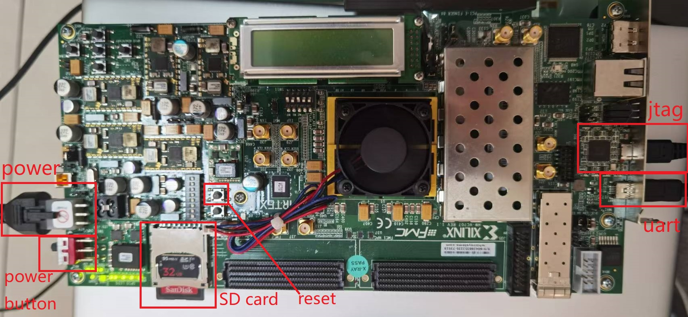

sycuricon( 二 ): starship
========================================

starship 是 riscv-spike-sdk 的姊妹 repo，提供了 riscv 仿真、验证、综合平台的硬件部分。

starship 的目录结构如下：

.. code-block:: sh

    .
    ├── asic            
    │   └── sim             # dut 仿真测试依赖的额外软件
    ├── build               # 编译的工作区域
    ├── build.sbt           # sbt 工具编译时依赖的 sbt 脚本
    ├── conf                # 编译时依赖的配置文件
    ├── firmware            # 芯片固件软件
    ├── LICENSE             # 证书
    ├── Makefile            # 编译脚本 makefile
    ├── patch               # 补丁，用于对 repo 代码做修改
    ├── project             # sbt 工具编译相关
    ├── README.md           # README
    ├── repo
    │   ├── riscv-boom                  # 生成 BOOM 乱序处理器
    │   ├── riscv-isa-sim               # cosim，用于处理器验证和差分测试
    │   ├── rocket-chip                 # 生成 rocket 顺序处理器
    │   ├── rocket-chip-blocks          # 为 rocket 外设生成提供模块
    │   ├── rocket-chip-fpga-shells     # 为 rocket 适配 fpga 外设引脚提供支持
    │   ├── starship                    # starship 本身依赖的生成配置和代码
    │   └── testchipip                  # 为 rocket 测试提供各种外设仿真模块
    └── target

想要快速了解工程各个 flow，生成 VC707 bitstream 下板验证的同学可以直接阅读 README.md 开始综合。

本文我们将对 starship 的各个部件进行介绍，并对仿真、综合的 flow 进行讲解。

综合下板
~~~~~~~~~~~~~~~~~~~~~~~~

我们首先介绍综合下板的流程。这个过程包括内核硬件代码的生成、固件软件的生成、外围硬件的生成、vivado 工程创建和综合等等。

流程简介
-----------------------

1. 首先设置需要生成的 verilog 的配置，starship 支持 rocket-chip、boom、cva6 等 core 的生成

2. sbt 根据 chisel 的配置收集需要的 chisel 代码，然后生成对应的 verilog，包括处理器的内核 core

3. 处理器的内核、处理器平台的总线、处理器平台的一些外设、处理器的外设控制器和暴露给外设的接口一起组成了 top，所以可以认为 top 就是生成的硬件平台

4. 处理器平台 top 和各个配合工作的外部模块（比如一些外设的 verilog 实现，一些外设的仿真实现，面向 fpga 的引脚）组成 TestHarness

5. 根据 chisel 中各个 memory 的配置生成对应的 memory 模块，编译存储在 memory 中的固件代码，这些代码会被 top 后期读入

6. 生成对应的 vivado tcl 编译脚本和 xdc 时序、引脚约束文件

7. vivado 编译得到最后的 bitstream

一些初始配置
------------------------

首先我们需要设置 RISCV 变量，定义编译使用的 RISCV 工具链的地址，也就是 riscv-spike-sdk 的 toolchain 的地址。

.. code-block:: sh

    export RISCV=/path/to/riscv-spike-sdk/toolchain

注意这里的路径最好用绝对路径，如果不设置 riscv 变量，makefile 也会亲切地给出报错。

.. code-block:: Makefile

    ifndef RISCV
        $(error $$RISCV is undefined, please set $$RISCV to your riscv-toolchain)
    endif

内核配置选择
------------------------

修改 conf/build.mk 当中的 STARSHIP_CORE 等参数。conf/build.mk 会被 Makefile 包含，这些配置参数会被用于 Makefile 后期的内核代码生成等。

.. code-block:: Makefile

    # Verilog Generation Configuration
    ##################################

    STARSHIP_CORE   ?= Rocket   # 处理器核的类型，包括 CVA6、Rocket、Boom
    STARSHIP_FREQ   ?= 100      # 处理器核的时钟频率，单位 MHz
    STARSHIP_TH     ?= starship.fpga.TestHarness            # 处理器的测试环境的模块名
    STARSHIP_TOP    ?= starship.fpga.StarshipFPGATop        # 处理器平台的模块名
    STARSHIP_CONFIG ?= starship.fpga.StarshipFPGAConfig     # 处理器配置的模块名

之后 Makefile 在生成 verilog 的时候就会根据这里的配置、时钟频率、处理器内核、硬件平台、测试环境进行 verilog 代码的生成。

``starship.fpga.TestHarness`` 等被定义在 repo/startship 当中。虽然 rocket 的代码来自 rocket-chip、rocket-chip-blocks、rocket-chip-fpga-shells，但是我们需要额外的 chisel 代码将这些模块组装统摄起来，这部分代码被写在 repo/starsthip 当中。分别位于 repo/starship/src/main/scala/fpga 的 Configs.scala 和 VC707.scala 当中。

应用 rocket-chip-fpga-shells 的补丁
-----------------------------------

在执行后续的代码生成之前，我们需要对 rocket-chip-fpga-shells 进行一些修改。

因为我们的 submodule 依赖于上游仓库，但是我们没有权利对上游仓库进行修改，如果我们把上游仓库 fork 下来进行维护也需要不断的同步，需要额外的人力成本，因此我们为每个需要做出调整的 submodule 提供了一些 patch，这样我们可以将修改保存到 patch 中，然后等后续需要应用修改时，再将 patch 应用到 submodule 上。

patch 的目录结构和文件作用描述如下：

.. code-block:: sh

    .
    ├── riscv-boom                  # riscv-boom 子模块的修改，仅用于对 riscv-boom 的仿真，综合的时候不可以打补丁
    ├── rocket-chip                 # rocket-chip 子模块的修改，仅用于对 rocket-chip 的仿真，综合的时候不可以打补丁
    └── rocket-chip-fpga-shells     # rocket-chip-fpga-shells 子模块的修改，仅用于综合生成 bitstream

我们对 rocket-chip-fpga-shells 的一些补丁功能进行简单的介绍：

* 1.patch：chisel 的黑箱模块允许 chisel class 内部直接用 verilog 模块替换实现，但是现在的 chisel 版本不提供黑箱模块的路径位置，因此该修改在模块内部加入 ``addResource("path name")`` 来提供模块 verilog 模块的路径位置。

* 2.patch：chisel 的 ddr 模块连接和顶层的 reset 存在兼容性问题，在这里予以修复

* 3.patch：对于 tcl 脚本中不适用的 pci 时钟和 jtag 始终进行注释

* 4.patch：对于 xdc 中不使用的 pci 引脚进行注释

* 5.patch：xilinxvc707mig 存在重名问题，这里予以更正

* 6.patch：jtag 模块的引脚存在问题，这里将引脚替换为 gpio 引脚

此外还有一个小细节，chisel 对一个 project 进行编译的时候，对于文件的目录结构有要求。src/main/scala 存放需要的 scala 文件，src/main/resource 存放 scala 中的 addResource 需要的文件。但是在 rockect-chip-fpga-shells 中，被以来的 resource 文件其实在 xilinx 文件夹中，因此需要在 resource 中构建对于 xilinx 的软链接。

.. code-block:: sh

    repo/rocket-chip-fpga-shells/src/main/resources$
    ln -s ../../../xilinx xilinx 

Verilog 编译
----------------------------------

配置简介
^^^^^^^^^^^^^^^^^^^^^^^^^^^^^^^^^^

首先我们来看生成 verilog 的时候使用的配置。

.. code-block:: Makefile

    #######################################
    #
    #         Verilog Generator
    #
    #######################################

    ROCKET_TOP      := $(STARSHIP_TH)
    ROCKET_CONF     := starship.With$(STARSHIP_CORE)Core,$(STARSHIP_CONFIG),starship.With$(STARSHIP_FREQ)MHz        
    ROCKET_SRC      := $(SRC)/rocket-chip
    ROCKET_BUILD    := $(BUILD)/rocket-chip
    ROCKET_SRCS     := $(shell find $(TOP) -name "*.scala")

* ROCKET_TOP：最终要生成顶层模块 starship.fpga.TestHarness 

* ROCKET_CONF：生成 rocket 使用的配置 starship.WithRocketCore, starship.fpga.StarshipFPGAConfig, starship.With100MHz

* ROCKET_SRC：源代码目录 repo/rocket-chip

* ROCKET_BUILD：变异的工作目录 build/rockect-chip

* ROCKET_SRCS：需要编译的源代码，仓库中所有的 scala 文件（当然，绝大多数无关的代码不会真的被编译）

到目前为止我们 chisel 生成依赖五个配置，之后根据这五个配置进行 verilog 生成。

* starship.WithRocketCore：定义 core 的类型

* starship.With100MHz：定义 core 的频率

* starship.fpga.StarshipFPGAConfig：硬件配置对应的包

* starship.fpga.StarshipFPGATop：硬件平台对应的包

* starship.fpga.StarshipFPGATestHarness：硬件整体对应的包

verilog 生成流程-代码部分
^^^^^^^^^^^^^^^^^^^^^^^^^^^^^^^^^^^^^^^

直接运行 ``make verilog`` 就可以编译得到需要的 verilog。如果对于实现原理没有兴趣，可以直接略过后续的内容。

我们来看一下 “verilog 生成流程-代码部分” 涉及的执行流程，首先执行如下的 Makefile：

.. code-block:: Makefile

    ROCKET_OUTPUT           := $(STARSHIP_CORE).$(lastword $(subst ., ,$(STARSHIP_TOP))).$(lastword $(subst ., ,$(STARSHIP_CONFIG)))ROCKET_FIRRTL   := $(ROCKET_BUILD)/$(ROCKET_OUTPUT).fir
    ROCKET_FIRRTL           := $(ROCKET_BUILD)/$(ROCKET_OUTPUT).fir
    ROCKET_ANNO             := $(ROCKET_BUILD)/$(ROCKET_OUTPUT).anno.json
    ROCKET_DTS              := $(ROCKET_BUILD)/$(ROCKET_OUTPUT).dts
    ROCKET_ROMCONF          := $(ROCKET_BUILD)/$(ROCKET_OUTPUT).rom.conf
    ROCKET_TOP_VERILOG      := $(ROCKET_BUILD)/$(ROCKET_OUTPUT).top.v
    ROCKET_TH_VERILOG       := $(ROCKET_BUILD)/$(ROCKET_OUTPUT).testharness.v
    ROCKET_TOP_INCLUDE      := $(ROCKET_BUILD)/$(ROCKET_OUTPUT).top.f
    ROCKET_TH_INCLUDE       := $(ROCKET_BUILD)/$(ROCKET_OUTPUT).testharness.f
    ROCKET_TOP_MEMCONF      := $(ROCKET_BUILD)/$(ROCKET_OUTPUT).sram.top.conf
    ROCKET_TH_MEMCONF       := $(ROCKET_BUILD)/$(ROCKET_OUTPUT).sram.testharness.conf

    $(ROCKET_FIRRTL) $(ROCKET_DTS) $(ROCKET_ROMCONF) $(ROCKET_ANNO)&: $(ROCKET_SRCS)
        mkdir -p $(ROCKET_BUILD)
        sbt "runMain starship.utils.stage.FIRRTLGenerator \
                --dir $(ROCKET_BUILD) \
                --top $(ROCKET_TOP) \
                --config $(ROCKET_CONF) \
                --name $(ROCKET_OUTPUT)"

这部分 target 调用 sbt 编译 rocket-chip 相关的源代码，生成 testHarness 相关的 fir 的中间代码，得到四个重要的中间文件：

* Rocket.StarshipFPGATop.StarshipFPGAConfig.anno.json：每个 class 生成过程中的额外 annonation 内容，用于后期进一步生成 Verilog

* Rocket.StarshipFPGATop.StarshipFPGAConfig.dts：生成的设备树，用于后续生成固件和系统软件

* Rocket.StarshipFPGATop.StarshipFPGAConfig.rom.conf：生成 Maskrom 的 memory 配置

* Rocket.StarshipFPGATop.StarshipFPGAConfig.fir：testHarness 的中间代码表示，chisel 先生成 fir，之后 fir 再生成 verilog 

之后执行 target 得到 top 和 testHarness 的 verilog，分别生成 top 和 testHarness 的 verilog 代码，并且生成其他一系列的代码：

.. code-block:: Makefile

    $(ROCKET_TOP_VERILOG) $(ROCKET_TOP_INCLUDE) $(ROCKET_TOP_MEMCONF) $(ROCKET_TH_VERILOG) $(ROCKET_TH_INCLUDE) $(ROCKET_TH_MEMCONF)&: $(ROCKET_FIRRTL)
        mkdir -p $(ROCKET_BUILD)
        sbt "runMain starship.utils.stage.RTLGenerator \
                --infer-rw $(STARSHIP_TOP) \
                -T $(STARSHIP_TOP) -oinc $(ROCKET_TOP_INCLUDE) \
                --repl-seq-mem -c:$(STARSHIP_TOP):-o:$(ROCKET_TOP_MEMCONF) \
                -faf $(ROCKET_ANNO) -fct firrtl.passes.InlineInstances \
                -X verilog $(FIRRTL_DEBUG_OPTION) \
                -i $< -o $(ROCKET_TOP_VERILOG)"
        sbt "runMain starship.utils.stage.RTLGenerator \
                --infer-rw $(STARSHIP_TH) \
                -T $(STARSHIP_TOP) -TH $(STARSHIP_TH) -oinc $(ROCKET_TH_INCLUDE) \
                --repl-seq-mem -c:$(STARSHIP_TH):-o:$(ROCKET_TH_MEMCONF) \
                -faf $(ROCKET_ANNO) -fct firrtl.passes.InlineInstances \
                -X verilog $(FIRRTL_DEBUG_OPTION) \
                -i $< -o $(ROCKET_TH_VERILOG)"
        touch $(ROCKET_TOP_INCLUDE) $(ROCKET_TH_INCLUDE)

最后生成的重要代码，我们部分介绍如下：

* testharness 和 top 相关的内存配置文件 conf：
    
    * Rocket.StarshipFPGATop.StarshipFPGAConfig.sram.testharness.conf
    
    * Rocket.StarshipFPGATop.StarshipFPGAConfig.sram.top.conf
    
* testharness 和 top 的中间结果和源代码，包括依赖的文件列表 f、中间代码表示 fir、寄存器序列 reglist、最终结果 v
    
    * StarshipFPGATop.fir
    
    * StarshipFPGATop.reglist
    
    * Rocket.StarshipFPGATop.StarshipFPGAConfig.top.f
    
    * Rocket.StarshipFPGATop.StarshipFPGAConfig.top.v
    
    * TestHarness.fir
    
    * TestHarness.reglist
    
    * Rocket.StarshipFPGATop.StarshipFPGAConfig.testharness.f
    
    * Rocket.StarshipFPGATop.StarshipFPGAConfig.testharness.v

* blockbox 引入的额外代码，被 AddResource 引入：
    
    * plusarg_reader.v
    
    * sdio.v
    
    * vc707reset.v

* vivado 的编译脚本、时序约束、引脚约束：

    * Rocket.StarshipFPGATop.StarshipFPGAConfig.old-shell.vivado.tcl
    
    * Rocket.StarshipFPGATop.StarshipFPGAConfig.vc707mig1gb.vivado.tcl
    
    * Rocket.StarshipFPGATop.StarshipFPGAConfig.vc707_sys_clock_mmcm1.vivado.tcl
    
    * Rocket.StarshipFPGATop.StarshipFPGAConfig.vc707_sys_clock_mmcm2.vivado.tcl

starship 代码简析
^^^^^^^^^^^^^^^^^^^^^^^^^^^^^^^^^^^^^^^

我们现在观察 starship 的源代码，src/main/scala/Configs.scala 的代码如下，定义了 Starship 最基本的平台配置。

.. code-block:: scala

    package starship

    case object FrequencyKey extends Field[Double](50)   // 50 MHz

    class WithFrequency(MHz: Double) extends Config((site, here, up) => {
        case FrequencyKey => MHz
    })

    class With25MHz  extends WithFrequency(25)
    class With50MHz  extends WithFrequency(50)
    class With100MHz extends WithFrequency(100)
    class With150MHz extends WithFrequency(150)

    class WithRocketCore extends Config(new WithNBigCores(1))
    class WithBOOMCore extends Config(new boom.common.WithNSmallBooms(1))
    class WithCVA6Core extends Config(new starship.cva6.WithNCVA6Cores(1))

    class StarshipBaseConfig extends Config(
        // new WithRoccExample ++
        new WithExtMemSize(0x80000000L) ++
        new WithNExtTopInterrupts(0) ++
        new WithDTS("zjv,starship", Nil) ++
        new WithEdgeDataBits(64) ++
        new WithCoherentBusTopology ++
        new WithoutTLMonitors ++
        new BaseConfig().alter((site,here,up) => {
            case BootROMLocated(x) => up(BootROMLocated(x), site).map { p =>
                // invoke makefile for zero stage boot
                val freqMHz = site(FPGAFrequencyKey).toInt * 1000000
                val path = System.getProperty("user.dir")
                val make = s"make -C firmware/zsbl ROOT_DIR=${path} img"
                println("[Leaving rocketchip] " + make)
                require (make.! == 0, "Failed to build bootrom")
                println("[rocketchip Continue]")
                p.copy(hang = 0x10000, contentFileName = s"build/firmware/zsbl/bootrom.img")
            }
        })
    )

我们可以找到 starship.WithRocketCore 和 starship.With100MHz 的定义。

starship.WithRocketCore 继承自 rocket-chip 中的 WithNBigCores(1)，说明生成一个功能完整的 rockect-chip 核。

starship.With100MHz 继承自 WithFrequency(100)，说明处理器的频率被设置为 100MHz。

starship.StarshipBaseConfig 定义了 starship 的基本配置：

    * WithExtMemSize(0x80000000L)：外部内存的内存大小是 0x80000000，这决定了 core 面向 memory 的总线大小
    
    * WithNExtTopInterrupts(0)：没有外部中断
    
    * WithDTS("zjv,starship", Nil)：定义设备树的名称，决定了生成的设备树的名称

    * BootROMLocated(x)：这里定义了 BootRom 的起始地址是 0x10000，进而影响设备树的生成和总线的生成；其次这里定义了一些 cmdline 脚本，该脚本执行 ``make -C firmware/zsbl`` 生成对应的 BootRom 固件镜像 build/firmware/zsbl/bootrom.img，然后 BootRom 用该内容作为固件内容

src/main/scala/top.scala 定义了最基本的平台实现，如 StarshipSystem 包含两个固件内存 bootRom 和 maskRom。

.. code-block:: scala

    class StarshipSystem(implicit p: Parameters) extends RocketSubsystem
        with HasAsyncExtInterrupts
    {
        val bootROM  = p(BootROMLocated(location)).map { BootROM.attach(_, this, CBUS) }
        val maskROMs = p(MaskROMLocated(location)).map { MaskROM.attach(_, this, CBUS) }

        override lazy val module = new StarshipSystemModuleImp(this)
    }

    class StarshipSystemModuleImp[+L <: StarshipSystem](_outer: L) extends RocketSubsystemModuleImp(_outer)
        with HasRTCModuleImp
        with HasExtInterruptsModuleImp
        with DontTouch

fpga 综合的硬件配置最终定义在 starship/src/main/scala/fpga 文件夹下，平台配置见 Configs.scala 文件。这里的 StarshipFPGAConfig 就是 build.mk 中定义的 starship.fpga.StarshipFPGAConfig 模块。

WithPeripherals 配置类型定义了平台的串口、spi 总线、maskrom 的 MMIO 地址范围，StarshipBaseConfig().alter 进一步定义了 DDR 内存的范围、没有 debug 模块等。

.. code-block:: scala

    package starship.fpga

    case object VCU707DDRSizeKey extends Field[BigInt](0x40000000L) // 1 GB

    class WithPeripherals extends Config((site, here, up) => {
        case PeripheryUARTKey => List(
            UARTParams(address = BigInt(0x64000000L)))
        case PeripherySPIKey => List(
            SPIParams(rAddress = BigInt(0x64001000L)))
        case MaskROMLocated(x) => List(
            MaskROMParams(BigInt(0x20000L), "StarshipROM")
        )
    })

    class StarshipFPGAConfig extends Config(
        new WithPeripherals ++
        new StarshipBaseConfig().alter((site,here,up) => {
            case DebugModuleKey => None
            case PeripheryBusKey => up(PeripheryBusKey, site).copy(dtsFrequency = Some(site(FrequencyKey).toInt * 1000000))     
            /* timebase-frequency = 1 MHz */
            case DTSTimebase => BigInt(1000000L)
            /* memory-size = 1 GB */
            case MemoryXilinxDDRKey => XilinxVC707MIGParams(address = Seq(AddressSet(0x80000000L,site(VCU707DDRSizeKey)-1)))    
            case ExtMem => up(ExtMem, site).map(x =>
            x.copy(master = x.master.copy(size = site(VCU707DDRSizeKey))))
        })
    )

Configs.scala 模块定义了平台的各个组件是否启用，各个组件的地址范围等，之后在 VC707.scala 进行模块的实现。这里的 StarshipFPGATop、TestHarness 就是 build.mk 中定义的 starship.fpga.StarshipFPGATop、starship.fpga.TestHarness 模块。

因为我们的平台需要串口、spi总线接口（连接 SD 卡）、DDR 三个外部设备，所以 StarshipFPGATop 加上了额外的 HasPeripheryUART、HasPeripherySPI、HasMemoryXilinxVC707MIG 三个 trait。

StarshipFPGATop 作为 LazyModule 需要 StarshipFPGATopModuleImp 在 diplomacy 之后加以最终实现，该模块用 HasPeripheryUARTModuleImp、HasPeripherySPIModuleImp、HasMemoryXilinxVC707MIGModuleImp 分配实现三个外设的连接。

TestHarness 扩展 rocket-chip-fpga-shells 的 VC707 FPGA 的连接层，然后对 Top 模块进行实例化，连接 clock 和 reset 等引脚。 

.. code-block:: scala

    package starship.fpga

    class StarshipFPGATop(implicit p: Parameters) extends StarshipSystem
        with HasPeripheryUART
        with HasPeripherySPI
        with HasMemoryXilinxVC707MIG
    {

        val chosen = new DeviceSnippet {
            def describe() = Description("chosen", Map(
                "bootargs" -> Seq(ResourceString("nokaslr"))
            ))
        }

        val mmc = new MMCDevice(tlSpiNodes.head.device)
        ResourceBinding {
            Resource(mmc, "reg").bind(ResourceAddress(0))
        }

        override lazy val module = new StarshipFPGATopModuleImp(this)

    }

    class StarshipFPGATopModuleImp[+L <: StarshipFPGATop](_outer: L) extends StarshipSystemModuleImp(_outer)
        with HasPeripheryUARTModuleImp
        with HasPeripherySPIModuleImp
        with HasMemoryXilinxVC707MIGModuleImp
        with DontTouch

    class TestHarness(override implicit val p: Parameters) extends VC707Shell
        with HasDDR3
    {

        dut_clock := (p(FPGAFrequencyKey) match {
            case 25 => clk25
            case 50 => clk50
            case 100 => clk100
            case 150 => clk150
        })

        withClockAndReset(dut_clock, dut_reset) {
            val top = LazyModule(new StarshipFPGATop)
            val dut = Module(top.module)

            connectSPI      (dut)
            connectUART     (dut)
            connectMIG      (dut)

            val childReset = dut_reset.asBool
            dut.reset := childReset

            dut.tieOffInterrupts()
            dut.dontTouchPorts()

            top.resetctrl.foreach { rc =>
                rc.hartIsInReset.foreach { _ := childReset }
            }
        }
    }

zsbl 的生成
^^^^^^^^^^^^^^^^^^^^^^^^^^^

BootRom 一般是 rocket-chip 自带的固件模块，实际上也可以不要这个模块，需要重新定位 ResetVector，还是比较麻烦的。我们来看 starship 的 Config.scala 可以看到这里执行 ``make -C firmware/zsbl ROOT_DIR=${path} img`` 命令生成 zsbl 的固件镜像，然后将镜像文件 ``build/firmware/zsbl/bootrom.img`` 的内容载入到 bootrom 中。

.. code-block:: scala

    case BootROMLocated(x) => up(BootROMLocated(x), site).map { p =>
        // invoke makefile for zero stage boot
        val freqMHz = site(FPGAFrequencyKey).toInt * 1000000
        val path = System.getProperty("user.dir")
        val make = s"make -C firmware/zsbl ROOT_DIR=${path} img"
        println("[Leaving rocketchip] " + make)
        require (make.! == 0, "Failed to build bootrom")
        println("[rocketchip Continue]")
        p.copy(hang = 0x10000, contentFileName = s"build/firmware/zsbl/bootrom.img")
    }

firmware/zsbl/bootrom.S 文件生成最后的 bootrom.img，其内容非常简单：

    * 关闭 rocket 中的 0x7c1 custom 寄存器（这是 rockect 当中作为 custom csr 示例的寄存器，因为我们用不到就在启动的时候关闭了）
    
    * 将 cpu 的 id 载入 a0 寄存器

    * 将设备树的地址载入 a1 寄存器，因为这个功能在我们的设计中交给了 fsbl，所以只是简单的传递一个 0

    * 跳到 0x20000，开始执行 fsbl 的代码

我们可以看到这个功能和 spike 的 0x10000 的启动固件非常相似，他们在设计上是同宗同源的。

.. code-block:: asm

    #define ROM_BASE 0x20000

    .section .text.start, "ax", @progbits
    .globl _start
    _start:
    csrwi 0x7c1, 0 // disable chicken bits
    li s0, ROM_BASE
    csrr a0, mhartid
    li a1, 0
    jr s0

我们可以在 top.v 中看到 BootROM 最终的实现 TLROM 模块，部分代码如下：

.. code-block:: Verilog

    wire [8:0] index = auto_in_a_bits_address[11:3];
    wire [3:0] high = auto_in_a_bits_address[15:12];
    wire [63:0] _GEN_1 = 9'h1 == index ? 64'h84024581f1402573 : 64'h204377c105073;
    wire [63:0] _GEN_2 = 9'h2 == index ? 64'h710b0000edfe0dd0 : _GEN_1;
    wire [63:0] _GEN_3 = 9'h3 == index ? 64'h1409000038000000 : _GEN_2;
    wire [63:0] _GEN_4 = 9'h4 == index ? 64'h1100000028000000 : _GEN_3;
    wire [63:0] _GEN_5 = 9'h5 == index ? 64'h10000000 : _GEN_4;
    wire [63:0] _GEN_6 = 9'h6 == index ? 64'hdc0800005d020000 : _GEN_5;

所以最后的实现就是一个二选一多路选择器序列，将 img 的二进制直接内嵌在电路当中，用诸如快查表 LUT 等电路来实现。这导致以下几个结果：

* 在电路性能上：当 img 比较小的时候这个电路非常简单，性能比较好，比如我们现在的 img 只有4-5 条指令；当 img 比较大的时候性能会很差

* 在 fsbl 上：因为 zsbl 不可以大，所以我们让 zsbl 仅做简单的初始化就跳转到 fsbl，而 fsbl 用 memory 的 ip 实现，时序会好很多

* 在镜像生成顺序上：因为 TLROM 的生成依赖于 img，所以要先生成 img 后生成 verilog；对于 fsbl 等 memory 用 readmemh 函数载入 hex 的模块，则可以 img 的生成晚于 verilog

* 在耦合性上：因为 verilog 和 img 是紧耦合的，这就导致一旦 img 需要有调整，要重新生成 top，其他的 memory 则不需要

* 在后端综合上：因为 TLROM 是简单的晶体管组成的，因此简单的流片技术路线上就可以流片成功，确保了好的兼容性，而其他 memory 也许会因为没有合适的 IP 或者集成技术而流产

verilog 生成流程-内存部分
^^^^^^^^^^^^^^^^^^^^^^^^^^^^^^^^^^^^^^^

上一阶段，我们生成了 verilog 的代码和各部分 memory 的配置，这一阶段，我们根据 memory 的配置生成对应的 memory 模块，并且生成每个模块对应的镜像文件。

实际上 memory 生成不是一件简单的事情，因为随着 memory 的位宽、深度、读写粒度、读写口个数不同，对应的 verilog 都是不同的。配置文件记录了每个内存的配置要求，比如：

.. code-block:: text

    Rocket.StarshipFPGATop.StarshipFPGADebugConfig.sram.top.conf:

    name data_arrays_0_ext depth 512 width 256 ports mrw mask_gran 8    
    name tag_array_ext depth 64 width 88 ports mrw mask_gran 22         
    name tag_array_0_ext depth 64 width 84 ports mrw mask_gran 21       
    name data_arrays_0_0_ext depth 512 width 128 ports mrw mask_gran 32 

之后调用 repo/rocket-chip/scripts/vlsi_mem_gen 进行内存生成，为每块内存生成定制化的 verilog 模块。

.. code-block:: Makefile

    #######################################
    #
    #         SRAM Generator
    #
    #######################################

    FIRMWARE_SRC    := $(TOP)/firmware
    FIRMWARE_BUILD  := $(BUILD)/firmware
    FSBL_SRC                := $(FIRMWARE_SRC)/fsbl
    FSBL_BUILD              := $(FIRMWARE_BUILD)/fsbl

    ROCKET_INCLUDE  := $(ROCKET_BUILD)/$(ROCKET_OUTPUT).f
    ROCKET_ROM_HEX  := $(FSBL_BUILD)/sdboot.hex
    ROCKET_ROM              := $(ROCKET_BUILD)/$(ROCKET_OUTPUT).rom.v
    ROCKET_TOP_SRAM := $(ROCKET_BUILD)/$(ROCKET_OUTPUT).behav_srams.top.v
    ROCKET_TH_SRAM  := $(ROCKET_BUILD)/$(ROCKET_OUTPUT).behav_srams.testharness.v

.. code-block:: Makefile

    VERILOG_SRC     := $(ROCKET_TOP_SRAM) $(ROCKET_TH_SRAM) \
        $(ROCKET_ROM) \
        $(ROCKET_TH_VERILOG) $(ROCKET_TOP_VERILOG)

    $(ROCKET_INCLUDE): | $(ROCKET_TH_INCLUDE) $(ROCKET_TOP_INCLUDE)
        mkdir -p $(ROCKET_BUILD)
        cat $(ROCKET_TH_INCLUDE) $(ROCKET_TOP_INCLUDE) 2> /dev/null | sort -u > $@
        echo $(VERILOG_SRC) >> $@
        sed -i "s/.*\.f$$/-f &/g" $@

    $(ROCKET_TOP_SRAM): $(ROCKET_TOP_MEMCONF)
        mkdir -p $(ROCKET_BUILD)
        $(ROCKET_SRC)/scripts/vlsi_mem_gen $(ROCKET_TOP_MEMCONF) > $(ROCKET_TOP_SRAM)

    $(ROCKET_TH_SRAM): $(ROCKET_TH_MEMCONF)
        mkdir -p $(ROCKET_BUILD)
        $(ROCKET_SRC)/scripts/vlsi_mem_gen $(ROCKET_TH_MEMCONF) > $(ROCKET_TH_SRAM)

    $(ROCKET_ROM_HEX): $(ROCKET_DTS)
        mkdir -p $(FSBL_BUILD)
        $(MAKE) -C $(FSBL_SRC) PBUS_CLK=$(STARSHIP_FREQ)000000 ROOT_DIR=$(TOP) DTS=$(ROCKET_DTS) hex
    
    $(ROCKET_ROM): $(ROCKET_ROM_HEX) $(ROCKET_ROMCONF)
        mkdir -p $(ROCKET_BUILD)
        $(ROCKET_SRC)/scripts/vlsi_rom_gen $(ROCKET_ROMCONF) $< > $@

    verilog: $(VERILOG_SRC)

这个阶段一共执行了四个部分：

* $(ROCKET_INCLUDE)：整合 Rocket.StarshipFPGATop.StarshipFPGAConfig.top.f 和 Rocket.StarshipFPGATop.StarshipFPGAConfig.testharness.f 生成最终的 Rocket.StarshipFPGATop.StarshipFPGAConfig.f，该文件记录本次生成依赖的所有文件

* $(ROCKET_TOP_SRAM)：vlsi_rom_gen 根据 Rocket.StarshipFPGATop.StarshipFPGAConfig.sram.top.conf 生成对应的 Rocket.StarshipFPGATop.StarshipFPGAConfig.sram.top.v，主要是 core 内部的各个 cache

* $(ROCKET_TH_SRAM)：vlsi_rom_gen 根据 Rocket.StarshipFPGATop.StarshipFPGAConfig.sram.testharness.conf 生成对应的 Rocket.StarshipFPGATop.StarshipFPGAConfig.sram.testharness.v

* $(ROCKET_ROM)：将 fsbl 生成代码，将 dts 作为 payload 生成内存 hex，然后 vlsi_rom_gen 根据 Rocket.StarshipFPGATop.StarshipFPGAConfig.rom.conf 生成 Rocket.StarshipFPGATop.StarshipFPGAConfig.rom.v，实现 MaskROM 模块，该模块内置的 readmemh 函数会将 hex 载入 memory 的

fsbl 的生成
^^^^^^^^^^^^^^^^^^^^^^^^^^^^

$(ROCKET_ROM) target 执行 ``make -C firmware/fsbl PBUS_CLK=100000000 ROOT_DIR=$(TOP) DTS=conf/starship.dts hex``，编译对应的镜像文件。

firmware/fsbl 负责初始化 spi 的控制寄存器，然后通过 spi 总线将 SD 卡内部的二进制镜像 copy 到内存中，并打印必要的 log，它的代码如下。

.. code-block:: sh

    .
    ├── common.h
    ├── head.S      # 读取 SD 卡，传递参数
    ├── include
    ├── kprintf.c   # 通过串口打印字符
    ├── kprintf.h
    ├── linker      
    ├── Makefile
    └── sd.c        # 读取 SD 卡的代码

我们来看一下 head.S 的代码：

.. code-block:: asm

        .section .text.init
        .option norvc
        .globl _prog_start
    _prog_start:
    #if defined UART && defined SD_SPI
        smp_pause(s1, s2)
        li sp, (PAYLOAD_DEST + 0xffff000)
        call main
        smp_resume(s1, s2)
    #endif
        csrr a0, mhartid // hartid for next level bootloader
        la a1, dtb // dtb address for next level bootloader
        li s1, PAYLOAD_DEST
        jr s1

        .section .dtb
        .align 3
    dtb:
        .incbin DEVICE_TREE

* 首先将 dts 文件用 dtc 编译为 dtb，这个 dtb 二进制会被保存在 fsbl 镜像的末尾，保存在 maskROM 当中
* 执行 smp_pause 函数，这个函数让 0 号处理器执行 fsbl 的启动，让其他的处理器执行 wfi，等待 0 号处理器执行完毕
* 如果 SD 卡设备和 UART 设备存在，执行 main 函数做 sd 内容读取和载入
* 执行 smp_resume，0 号寄存器唤醒其他的处理器继续执行
* 将 mhartid 写入 a0，把 dtb 地址写入 a1，跳转到 0x80000000 的地址，开始执行 bootloader

smp_pause 和 smp_resume 的执行过程大致如下：

.. code-block:: text

           id0                  id_other
            |                       |
            |                       |
            |  smp_pause            |
            |       |               |
            |  mhartid == 0 ?       +-------+
            |       |                       |
            |       Y                       |
            |       |                       |
            |   main, read SD               |
            |       |                       |
            |   smp_resume                  |
            |       |                       |
        +---+   wake_up_wfi                 |
        |           |                       |
        |          wfi      +---------------+
        |           |       |
        +---+     other     |
           \|/             \|/
            |               |

然后我们来看 sd.c 中的 main 函数，如何进行 sd 卡的读取:

* 首先调用 sd_poweron 对 SD 卡进行启动

* 依次调用 sd_cmd0、8、41、58、16 设置 spi 总线的管理

* 最后调用 copy 读取 SD 卡中的扇区写入内存

.. code-block:: c

    int main(void)
    {
    #if defined UART && defined SD_SPI
            REG32(uart, UART_REG_TXCTRL) = UART_TXEN;
            kprintf("[FSBL] Starship SoC under %lx Hz\r\n", F_CLK);
            kputs("INIT");

            sd_poweron();
            if (sd_cmd0() ||
                sd_cmd8() ||
                sd_acmd41() ||
                sd_cmd58() ||
                sd_cmd16() ||
                copy()) {
                    kputs("ERROR");
                    return 1;
            }

            kputs("BOOT");
    #endif

            __asm__ __volatile__ ("fence.i" : : : "memory");
            return 0;
    }

在启动的过程中 fsbl 会将一些中间信息通过串口输出，如果执行正常就会输出如下的 log，如果遇到错误会输出 ERROR。

.. code-block:: text

    [FSBL] Starship SoC under 0000000002faf080 Hz
    INIT
    CMD0
    CMD8
    ACMD41
    CMD58
    CMD16
    CMD18
    LOADING
    BOOT

此外注意一个额外的参数 PAYLOAD_SIZE。copy 每次会读 512 个字节，这里将 PAYLOAD_SIZE 设置为 24<<11，这样就可以读入 (24<<11)*512 个字节，也就是 24MiB 数据。当我们将 bbl.bin 写入到 SD 卡中的时候，需要看一下 bbl.bin 的大小，如果是 24MiB 以内则不需要做调整，如果大于 24MiB，则需要修改 PAYLOAD_SIZE 的大小至合适的范围（也不能设置的太大，读 SD 卡很慢的）。

.. code-block:: C

    // A sector is 512 bytes, so ((1 << 11) * 512) = 1 MiB
    #define PAYLOAD_SIZE    (24 << 11)

vivado 综合
^^^^^^^^^^^^^^^^^^^^^^^^^^^^^^

首先需要安装 vivado。然后执行 ``make bitstream`` 就可以根据 tcl 的命令，构造 project，并将 verilog 编译为 bitstream。

FPGA 板卡的类型参见 build.mk 中的 STARSHIP_BOARD 变量，这里选择为 vc707 板子（目前仅支持这一种板子）。

之后 vivado 执行 tcl 脚本，对需要的 verilog 代码和 xdc 引脚约束进行综合，参数参见如下：

    * -source：repo/rocket-chip-fpga-shells/xilinx/common/tcl/vivado.tcl 为执行的编译脚本

    * -F：build/rocket-chip/Rocket.StarshipSimTop.StarshipSimDebugConfig.f 为所有需要被综合的 verilog 源代码

    * -top-module：TestHarness 模块作为顶层模块

    * -ip-vivado-tcls：所有 .vivado.tcl 结尾的 tcl 脚本，包括：

        * Rocket.StarshipFPGATop.StarshipFPGAConfig.vc707mig1gb.vivado.tcl

        * Rocket.StarshipFPGATop.StarshipFPGAConfig.vc707_sys_clock_mmcm1.vivado.tcl

        * Rocket.StarshipFPGATop.StarshipFPGAConfig.vc707_sys_clock_mmcm2.vivado.tcl

        * Rocket.StarshipFPGATop.StarshipFPGAConfig.old-shell.vivado.tcl
    
    * -board：VC707 为板子型号

.. code-block:: Makefile

    # FPGA Configuration
    ####################

    STARSHIP_BOARD  ?= vc707

    #######################################
    #
    #         Bitstream Generator
    #
    #######################################

    VIVADO_TOP              := $(lastword $(subst ., ,$(STARSHIP_TH)))
    VIVADO_SRC              := $(SRC)/rocket-chip-fpga-shells
    VIVADO_SCRIPT           := $(VIVADO_SRC)/xilinx
    VIVADO_BUILD            := $(BUILD)/vivado
    VIVADO_BITSTREAM        := $(VIVADO_BUILD)/$(ROCKET_OUTPUT).bit

    $(VIVADO_BITSTREAM): $(ROCKET_INCLUDE) $(VERILOG_SRC)
            mkdir -p $(VIVADO_BUILD)
            cd $(VIVADO_BUILD); vivado -mode batch -nojournal \
                    -source $(VIVADO_SCRIPT)/common/tcl/vivado.tcl \
                    -tclargs -F "$(ROCKET_INCLUDE)" \
                    -top-module "$(VIVADO_TOP)" \
                    -ip-vivado-tcls "$(shell find '$(ROCKET_BUILD)' -name '*.vivado.tcl')" \
                    -board "$(STARSHIP_BOARD)"

    bitstream: $(VIVADO_BITSTREAM)

最后的 vivado 工程见 build/vivado，其中 bitstream 文件在 build/vivado/obj/TestHarness.bit

下板连接
^^^^^^^^^^^^^^^^^^^^^^^^^^

现在我们进行下板测试，首先对 VC707 板子进行连接。这里我们介绍一下连接方式和 VC707 的一些使用方式。

* 根据 riscv-spike-sdk 一文的介绍制作 SD 卡，然后插入 SD 卡槽，下板之后处理器会读取内部的数据写入内存

* 连接 jtag 端口，一端插入板卡，一端插入主机的 USB 口，之后下板子的 bitstream 二进制就是通过这根线输入的

* 连接 uart 端口，一端插入板卡，一端插入主机的 USB 口，串口将下板子的处理器信号打印到主机屏幕终端

* 连接电源线，电源线比较难拔，需要将上面的钩子先掰开再拔

* 打开电源开关，启动开发板

* 按压 reset 按钮可以对 FPGA 中的寄存器进行复位

下板子之前，我们需要在主机建立可以显示 uart 输出的终端，这里我们新建一个 terminal，然后确认 UART 的 ttyUSB0 端口设备已经被识别，然后执行：

.. code-block:: sh

    sudo screen -S FPGA /dev/ttyUSB0 115200

之后打开 vivado，然后进行 hardware connection，然后将 obj/testharness.bit 下板子即可。之后板子就会启动，然后开始执行，首先输出 fsbl 的 log，然后输出 bbl 的 log，最后输出 linux 的启动 log，然后启动命令行。

之后用户就可以输入用户名 root，然后开始执行简单的命令行操作，比如 ``ls`` 、 ``cd`` 等。

.. code-block:: sh

    [FSBL] Starship SoC under 0000000002faf080 Hz
    INIT
    CMD0
    CMD8
    ACMD41
    CMD58
    CMD16
    CMD18
    LOADING
    BOOT
    bbl loader

    ...

    [    0.000000] Linux version 6.11.4-g17365d66f1c6 (zyy@zyy-OptiPlex-7060) (riscv64-unknown-linux-gnu-gcc (g04696df09) 14.2.0, GNU ld (GNU Binutils) 2.43.1) #1 SMP Fri Nov 29 18:55:58 +08 2024
    [    0.000000] Machine model: zjv,starship
    [    0.000000] SBI specification v0.1 detected
    [    0.000000] efi: UEFI not found.
    [    0.000000] OF: reserved mem: 0x0000000080000000..0x000000008001ffff (128 KiB) nomap non-reusable mmode_resv0@80000000
    [    0.000000] OF: reserved mem: 0x0000000080020000..0x000000008003ffff (128 KiB) nomap non-reusable mmode_resv1@80020000
    [    0.000000] Zone ranges:
    [    0.000000]   DMA32    [mem 0x0000000080000000-0x00000000bfffffff]
    [    0.000000]   Normal   empty
    [    0.000000] Movable zone start for each node
    [    0.000000] Early memory node ranges
    [    0.000000]   node   0: [mem 0x0000000080000000-0x000000008003ffff]
    [    0.000000]   node   0: [mem 0x0000000080040000-0x00000000bfffffff]
    [    0.000000] Initmem setup node 0 [mem 0x0000000080000000-0x00000000bfffffff]
    [    0.000000] Falling back to deprecated "riscv,isa"
    [    0.000000] riscv: base ISA extensions acdfim
    [    0.000000] riscv: ELF capabilities acdfim
    [    0.000000] percpu: Embedded 14 pages/cpu s26840 r0 d30504 u57344
    [    0.000000] Kernel command line: nokaslr console=hvc0
    [    0.000000] Unknown kernel command line parameters "nokaslr", will be passed to user space.
    [    0.000000] Dentry cache hash table entries: 131072 (order: 8, 1048576 bytes, linear)
    [    0.000000] Inode-cache hash table entries: 65536 (order: 7, 524288 bytes, linear)
    [    0.000000] Built 1 zonelists, mobility grouping on.  Total pages: 262144
    [    0.000000] mem auto-init: stack:all(zero), heap alloc:off, heap free:off
    [    0.000000] SLUB: HWalign=64, Order=0-3, MinObjects=0, CPUs=1, Nodes=1
    [    0.000000] rcu: Hierarchical RCU implementation.
    [    0.000000] rcu:     RCU restricting CPUs from NR_CPUS=64 to nr_cpu_ids=1.
    [    0.000000] rcu: RCU calculated value of scheduler-enlistment delay is 10 jiffies.
    [    0.000000] rcu: Adjusting geometry for rcu_fanout_leaf=16, nr_cpu_ids=1
    [    0.000000] NR_IRQS: 64, nr_irqs: 64, preallocated irqs: 0
    [    0.000000] riscv-intc: 64 local interrupts mapped
    [    0.000000] riscv: providing IPIs using SBI IPI extension
    [    0.000000] rcu: srcu_init: Setting srcu_struct sizes based on contention.
    [    0.000000] clocksource: riscv_clocksource: mask: 0xffffffffffffffff max_cycles: 0x1d854df40, max_idle_ns: 3526361616960 ns
    [    0.000013] sched_clock: 64 bits at 1000kHz, resolution 1000ns, wraps every 2199023255500ns
    [    0.001639] Console: colour dummy device 80x25
    [    0.002142] Calibrating delay loop (skipped), value calculated using timer frequency.. 2.00 BogoMIPS (lpj=10000)
    [    0.002369] pid_max: default: 32768 minimum: 301
    [    0.004757] Mount-cache hash table entries: 2048 (order: 2, 16384 bytes, linear)
    [    0.005185] Mountpoint-cache hash table entries: 2048 (order: 2, 16384 bytes, linear)
    [    0.036645] riscv: ELF compat mode unsupported
    [    0.036784] ASID allocator disabled (0 bits)
    [    0.039327] rcu: Hierarchical SRCU implementation.
    [    0.039436] rcu:     Max phase no-delay instances is 1000.
    [    0.048210] EFI services will not be available.
    [    0.050523] smp: Bringing up secondary CPUs ...
    [    0.050742] smp: Brought up 1 node, 1 CPU
    [    0.052106] Memory: 1004400K/1048576K available (4420K kernel code, 4522K rwdata, 2048K rodata, 10533K init, 348K bss, 40812K reserved, 0K cma-reserved)
    [    0.057762] devtmpfs: initialized
    [    0.076364] clocksource: jiffies: mask: 0xffffffff max_cycles: 0xffffffff, max_idle_ns: 19112604462750000 ns  
    [    0.076644] futex hash table entries: 256 (order: 2, 16384 bytes, linear)
    [    0.078623] DMI not present or invalid.
    [    0.089588] NET: Registered PF_NETLINK/PF_ROUTE protocol family
    [    0.093916] DMA: preallocated 128 KiB GFP_KERNEL pool for atomic allocations
    [    0.094373] DMA: preallocated 128 KiB GFP_KERNEL|GFP_DMA32 pool for atomic allocations
    [    0.163664] cpu0: Ratio of byte access time to unaligned word access is 0.03, unaligned accesses are slow     
    [    0.199579] SCSI subsystem initialized
    [    0.205291] pps_core: LinuxPPS API ver. 1 registered
    [    0.205410] pps_core: Software ver. 5.3.6 - Copyright 2005-2007 Rodolfo Giometti <giometti@linux.it>
    [    0.205846] PTP clock support registered
    [    0.217558] clocksource: Switched to clocksource riscv_clocksource
    [    0.389345] NET: Registered PF_INET protocol family
    [    0.393224] IP idents hash table entries: 16384 (order: 5, 131072 bytes, linear)
    [    0.420910] tcp_listen_portaddr_hash hash table entries: 512 (order: 1, 8192 bytes, linear)
    [    0.421343] Table-perturb hash table entries: 65536 (order: 6, 262144 bytes, linear)
    [    0.421585] TCP established hash table entries: 8192 (order: 4, 65536 bytes, linear)
    [    0.423622] TCP bind hash table entries: 8192 (order: 6, 262144 bytes, linear)
    [    0.429227] TCP: Hash tables configured (established 8192 bind 8192)
    [    0.431512] UDP hash table entries: 512 (order: 2, 16384 bytes, linear)
    [    0.432142] UDP-Lite hash table entries: 512 (order: 2, 16384 bytes, linear)
    [    0.434247] NET: Registered PF_UNIX/PF_LOCAL protocol family
    [    0.459736] workingset: timestamp_bits=62 max_order=18 bucket_order=0
    [    0.464489] io scheduler mq-deadline registered
    [    0.464637] io scheduler kyber registered
    [    0.465026] io scheduler bfq registered
    [    0.481383] riscv-plic: interrupt-controller@c000000: mapped 2 interrupts with 1 handlers for 2 contexts.     
    [    2.416539] printk: legacy console [hvc0] enabled
    [    2.903905] Serial: 8250/16550 driver, 4 ports, IRQ sharing disabled
    [    2.941752] sifive_spi 64001000.spi: mapped; irq=12, cs=1
    [    3.007639] mmc_spi spi0.0: SD/MMC host mmc0, no WP, no poweroff, cd polling
    [    3.025058] NET: Registered PF_PACKET protocol family
    [    3.164210] clk: Disabling unused clocks
    [    3.324402] Freeing unused kernel image (initmem) memory: 10532K
    [    3.330388] Run /init as init process
    [    3.451837] mmc0: host does not support reading read-only switch, assuming write-enable
    [    3.459827] mmc0: new SDHC card on SPI
    [    3.496629] mmcblk0: mmc0:0000 SD32G 29.7 GiB
    [    3.699974]  mmcblk0: p1 p2
    Saving 256 bits of non-creditable seed for next boot
    Starting syslogd: OK
    Starting klogd: OK
    Running sysctl: OK
    Starting network: OK
    Starting crond: OK

    Welcome to Buildroot
    buildroot login: root
    Password:
    # cat /proc/cpuinfo
    hart    : 0
    isa     : rv64imafdc
    mmu     : sv39
    uarch   : sifive,rocket0

有的时候启动会失败，比如 fsbl 读入 SD 卡的时候输出 ERROR 如下：

.. code-block:: sh

    [FSBL] Starship SoC under 0000000002faf080 Hz
    INIT
    CMD0
    ERROR

或者 fsbl 输出 BOOT 之后就启动失败了，如：

.. code-block:: sh

    [FSBL] Starship SoC under 0000000002faf080 Hz
    INIT
    CMD0
    CMD8
    ACMD41
    CMD58
    CMD16
    CMD18
    LOADING
    BOOT

可以考虑如下方式解决：

* 按 reset 按钮，重新复位或者开闭打开 vc707 电源，进行重启

* 插拔 SD 卡，防止接触不良

* 重新下载 bitstream 防止文件下载出现损坏

* 重新格式化 SD 卡，重新下载系统镜像

* 换一张 SD 卡，排除 SD 卡损坏的情况

如果是启动到 bbl 和 linux 的时候出现了错误，请检查设备树和 linux 配置等参数，然后根据报错的 log 进行调试修复。

如果系统文件在 spike 上和在下板子的时候都执行错误，且报错一样，则说明这个问题可以在模拟器上复现，则应该在模拟器上先排除这个错误，然后重新下板子。

如果这个问题只在板子上存在，在模拟器上不存在，有可能是设备树导致的，检查设备树是否存在问题。

其他的只能见招拆招了。

设备树的构建和修复
^^^^^^^^^^^^^^^^^^^^^^^^^^^^

starship 的软件的设备树，我们直接使用 conf/starship.dts，我们现在介绍一下这个 dts 的组成和修改，为后期的维护和迭代提供指导和依据。

首先在 ``make verilog`` 的时候，rocket-chip 会自己生成 rocket-chip 核和 SoC 的设备树，可以参见 build/rocket-chip/Rocket.StarshipFPGATop.StarshipFPGAConfig.dts。

之后我们对这个 dts 作出修改。因为在最新的 linux 内核中，0x80000000-0x80200000 的的地址空间也会被 linux 的伙伴系统接管，然后 malloc 作为 page 使用。但是这就会导致 bbl 的内容被读写，这部分地址是被 pmpaddr、pmpcfg 保护的，所以会触发 access fault。

为了防止 linux 读写 bbl 的内存空间，我们在设备树中加入 reserved memory 的 region，不让它分配这部分的内容，可以在 conf/spike.cfg 和 conf/starship.cfg 中看到这部分内容。

下图是 starship.dts 增加的 resered-memory 节点，spike 的大同小异，这样可以阻止 linux 读写 0x80000000-0x80040000 的地址范围。

.. code-block:: dts

    reserved-memory {
            #address-cells = <1>;
            #size-cells = <1>;
            ranges;

            mmode_resv1@80020000 {
                reg = <0x80020000 0x20000>;
                no-map;
            };

            mmode_resv0@80000000 {
                reg = <0x80000000 0x20000>;
                no-map;
            };
    };

在内核启动的时候，我们就可以看到这部分额外的 log：

.. code-block:: sh

    [    0.000000] OF: reserved mem: 0x0000000080000000..0x000000008001ffff (128 KiB) nomap non-reusable mmode_resv0@80000000
    [    0.000000] OF: reserved mem: 0x0000000080020000..0x000000008003ffff (128 KiB) nomap non-reusable mmode_resv1@80020000

