sycuricon( 六 ): 流片
======================================

我们在 rocket-chip 的 regvault 扩展的基础上进行整改，然后将该设计用于芯片流片。

流片起因：浙大求是安全芯 ZJV
~~~~~~~~~~~~~~~~~~~~~~~~~~~~~~~~~

浙大求是安全芯是浙江大学计算机科学与技术学院/网络空间安全学院申文博老师、常瑞老师的芯片项目，旨在扩展芯片安全架构，实现新型的芯片安全机制，同时提供真实的芯片实验平台。

求是安全芯 I 号实现了 rocket-chip 的 regvault 扩展，我们小组负责处理器内核的前端设计，由一生一芯团队提供处理器外围和后端版图，最后交给代工厂流片。

前端代码调整和实现
~~~~~~~~~~~~~~~~~~~~~~~~~~~~~~~~~~

为了让我们 rocket-chip 的核内实现和一生一芯团队提供的芯片外围可以对接起来，我们需要对 rocket-chip 做一些调整，我们在 regvault 的基础上新建了 no-io 分支来实现这部分内容。

删除处理器外围
---------------------------------

因为我们的处理器使用一生一芯的外围，所以我们需要首先删除 VC707Shell 提供的外围和其他的外设支持。我们在 repo/starship/src/main/scala 中新建了 Axi4 文件夹，里面是对应的模块实现，旨在删除外围部件，仅保留一个 memory 接口和一个 MMIO 接口。

修改 AXI4Top.scala 模块：

* 定义 StarshipAxi4Top 作为顶层模块
* 定义 StarshipAxi4TopModuleImp 作为顶层模块的实现
* 将原有的 PeripherySPIKey、PeripheryUARTKey 等配置删除，不生成 SPI、UART 等外设驱动
* 仅保留 CanHaveMasterAXI4MemPort、CanHaveMasterAXI4MMIOPort、HasPeripheryDebug，保留内存总线接口、MMIO 接口、调试模块接口

.. remotecode:: ../_static/tmp/starship_axi4_top
	:url: https://github.com/sycuricon/starship/blob/fd5d82309900869f8787f1141857f770a499b738/repo/starship/src/main/scala/axi4/AXI4Top.scala
	:language: scala
	:type: github-permalink
	:lines: 18-33
	:caption: StarshipAxi4Top

删除处理器插桩
----------------------

因为我们之前的处理器用于模糊测试，所以需要在处理器生成的过程中进行插桩，因此我们在 repo/starship/src/main/scala/utils/StarshipStage.scala 中定义了插桩的过程。

我们将 override 的 run 函数进行修改，将里面的 ``RunFirrtlTransformAnnotation(Dependency[CoverageInstrument])`` 注释掉，这样生成的 verilog 就没有对应的 coverage_sum 的插桩了。

.. remotecode:: ../_static/tmp/starship_axi4_stage
	:url: https://github.com/sycuricon/starship/blob/fd5d82309900869f8787f1141857f770a499b738/repo/starship/src/main/scala/utils/StarshipStage.scala
	:language: scala
	:type: github-permalink
	:lines: 106-114
	:caption: 删除 coverage sum 插桩

修改 MMIO 范围
--------------------------

一生一芯提供的外围的 MMIO 地址范围在 0x1000000-0x80000000，所以我们需要将 MMIO 的地址范围做对应的修改，不然到时候核内寻址不会将地址读写请求从 MMIO 口中发送出来。

这里对 Config.scala 进行修改，可以看到 BaseConfig 对 ExtBus 参数进行了修改，将 base 设置为 0x1000_0000，将 size 设置为 0x7000_0000。

.. remotecode:: ../_static/tmp/starship_axi4_base_config
	:url: https://github.com/sycuricon/starship/blob/fd5d82309900869f8787f1141857f770a499b738/repo/starship/src/main/scala/Configs.scala
	:language: scala
	:type: github-permalink
	:lines: 40-66
	:caption: 修改 ExtBus 范围

这样我们就完成了对 MMIO 范围的修改，此时我们生成最后的 verilog，可以检查对应的设备树，可以看到：

.. code-block:: text

    L12: mmio-port-axi4@10000000 {
        #address-cells = <1>;
        #size-cells = <1>;
        compatible = "simple-bus";
        ranges = <0x10000000 0x10000000 0x70000000>;
    };

启动过程调整
-----------------------

在一生一芯提供的启动过程中，我们的处理器从 0x30000000 开始启动，然后开始访问对应地址范围的 flash。该 flash 前半部分是一段启动代码，后半部分是系统程序镜像，处理器执行前半部分的启动代码将程序镜像 copy 到内存中，然后开始后续的系统启动。

所以我们让处理器在 zsbl 当中执行 0x30000000 的跳转。所以对 firmware 的 zsbl 代码进行调整，修改为

.. remotecode:: ../_static/tmp/starship_axi4_zsbl
	:url: https://github.com/sycuricon/starship/blob/fd5d82309900869f8787f1141857f770a499b738/firmware/zsbl/bootrom.S
	:language: scala
	:type: github-permalink
	:caption: zsbl 跳转到 0x30000000 启动

这一看到这个时候 maskrom 已经没有用了，所以我们可以把 maskrom 删除掉。修改 Top.scala 的 StarshipSystem，删除 maskrom 的实例化：

.. remotecode:: ../_static/tmp/starship_axi4_base_top
	:url: https://github.com/sycuricon/starship/blob/fd5d82309900869f8787f1141857f770a499b738/repo/starship/src/main/scala/Top.scala
	:language: scala
	:type: github-permalink
	:lines: 19-24
	:caption: 删除 maskrom

在 AXI4Top/Config.scala，在原来 regvault 的 Config 的基础上，删除了 WithPeripherals 配置，这样内部的 TileLink 就不会生成 maskrom 对应的路由。

.. remotecode:: ../_static/tmp/starship_axi4_config
	:url: https://github.com/sycuricon/starship/blob/fd5d82309900869f8787f1141857f770a499b738/repo/starship/src/main/scala/axi4/Configs.scala
	:language: scala
	:type: github-permalink
	:lines: 15-30
	:caption: 删除 WithPeripherals

Verilog 代码生成
----------------------------

修改 conf/build.mk 的配置为对应的：

.. remotecode:: ../_static/tmp/starship_axi4_conf_build_mk
	:url: https://github.com/sycuricon/starship/blob/fd5d82309900869f8787f1141857f770a499b738/conf/build.mk
	:language: scala
	:type: github-permalink
	:lines: 1-8
	:caption: axi4 对应的生成配置

然后执行 ``make vlt`` 就可以得到需要的代码，我们将必要的代码取出即可：

* plusarg_reader.v
* Rocket.StarshipAxi4Top.StarshipAxi4DebugConfig.top.v

IP 核的替换
-------------------

我们 Top 内部的 cache 是用 array 实现的，但是当我们将代码综合为后端版图的时候，这些 array 只能被综合成一些离散的寄存器。但实际上为了节约芯片面积，我们希望用 sram IP 核来替换这些 array 模块，这样我们综合的版图就可以用 SRAM 实现 cache。

需要替换的主要就是 icache、dcache 的 data array 和 tage array，他们的尺寸可以用 512x64、64x84、64x88 的 sram ip 拼接而成。

我们用 sram 自动化工具生成对应的 sram 文件，这些工业级的 ip 核输入输出引脚一般如下：

* CE：芯片使能信号，只有当 CE=0 的时候才可以执行读写操作
* WE：芯片写使能信号，只有当 WE=0 的时候才可以执行写操作
* A：地址信号线
* D：数据信号线
* BWE：芯片位写使能信号线，只有当对应位的 BWE=0 的时候才可以对这个位执行写操作
* Q：芯片数据输出
* 时序：芯片的读写操作都需要等待一个周期完成

然后我们对 Top 中的 array 进行替换，实际上只需要对自动化生成的 array 模块做替换即可，但是因为经验不足对 top 的源代码做了替换，到之后后续每次重新生成 top 都要替换一次代码。

注意：

* rocket 中的使能信号都是高电平使能，这里需要手动修改为低电平使能
* rocket 的段使能都是多位的，而 sram 的段使能是单位的，需要做一个转换

接入一生一芯外围
-----------------------

这部分由一生一芯团队提供测试仿真的外围环境，因为他们的外围只有一个面向处理器的 AXI 口，因此需要额外生成一个 NIC 桥将我们处理器的两个口转换为一个口，然后和外围连接。

这部分代码因为是合作方技术产权，所以不予开源。

增加 debug module 支持
--------------------------

我们将 Testharness 当中 Top 外围的 debug module 的连接模块从源文件中剥离出来，然后让 Top 进行连接，这部分的电路图我们在 debug module 一文中已经绘制过了，现在将 debug module 相关的代码附加如下，需要的朋友可以自己 copy：

.. code-block:: Verilog

    module core_wrapper (
        input  logic        clock,
        input  logic        reset,
        input  logic        io_debug_reset,
        input  logic        io_jtag_TCK,
        input  logic        io_jtag_TMS,
        input  logic        io_jtag_TDI,
        output logic        io_jtag_TDO,
        ...
    );

    logic top_clock;
    logic top_reset;
    logic top_resetctrl_hartIsInReset_0;
    logic debug_clock;
    logic debug_reset;
    logic debug_systemjtag_reset;
    logic debug_ndreset;
    logic debug_dmactive;
    logic debug_dmactiveAck;

    TopJTAGLInk u_TopJTAGLInk (
        .clock                        (clock),
        .io_reset                     (reset),
        .io_debug_reset               (io_debug_reset),
        .top_clock                    (top_clock),
        .top_reset                    (top_reset),
        .top_resetctrl_hartIsInReset_0(top_resetctrl_hartIsInReset_0),
        .debug_clock                  (debug_clock),
        .debug_reset                  (debug_reset),
        .debug_systemjtag_reset       (debug_systemjtag_reset),
        .debug_ndreset                (debug_ndreset),
        .debug_dmactive               (debug_dmactive),
        .debug_dmactiveAck            (debug_dmactiveAck)
    );

    assign io_mst_mmio_araddr[31] = '0;
    assign io_mst_mmio_awaddr[31] = '0;
    StarshipAxi4Top u_StarshipAxi4Top (
        .clock                           (top_clock),
        .reset                           (top_reset),
        .resetctrl_hartIsInReset_0       (top_resetctrl_hartIsInReset_0),
        .debug_clock                     (debug_clock),
        .debug_reset                     (debug_reset),
        .debug_systemjtag_jtag_TCK       (io_jtag_TCK),
        .debug_systemjtag_jtag_TMS       (io_jtag_TMS),
        .debug_systemjtag_jtag_TDI       (io_jtag_TDI),
        .debug_systemjtag_jtag_TDO_data  (io_jtag_TDO),
        .debug_systemjtag_jtag_TDO_driven(),
        .debug_systemjtag_reset          (debug_systemjtag_reset),
        .debug_systemjtag_mfr_id         ('0),
        .debug_systemjtag_part_number    ('0),
        .debug_systemjtag_version        ('0),
        .debug_ndreset                   (debug_ndreset),
        .debug_dmactive                  (debug_dmactive),
        .debug_dmactiveAck               (debug_dmactiveAck),
        ...
    );

    endmodule

    module TopJTAGLInk (
        input logic clock,
        input logic io_reset,
        input logic io_debug_reset,

        output logic top_clock,
        output logic top_reset,
        output logic top_resetctrl_hartIsInReset_0,
        output logic debug_clock,
        output logic debug_reset,
        output logic debug_systemjtag_reset,
        input  logic debug_ndreset,
        input  logic debug_dmactive,
        output logic debug_dmactiveAck
    );

        assign top_clock = clock;

        logic sync_debug_ndreset;
        AsyncResetRegVec_w1_i0_tb debug_ndreset_sync (
            .clock(clock),
            .reset(io_reset),
            .io_d (debug_ndreset),
            .io_q (sync_debug_ndreset)
        );
        assign top_reset                     = io_reset | sync_debug_ndreset;
        assign top_resetctrl_hartIsInReset_0 = top_reset;

        assign debug_systemjtag_reset        = io_debug_reset;
        logic sync_io_debug_reset;
        AsyncResetSynchronizerShiftReg_w1_d3_i0_tb io_debug_reset_shift_sync (
            .clock(clock),
            .reset(io_debug_reset),
            .io_q (sync_io_debug_reset)
        );
        assign debug_reset = ~sync_io_debug_reset;

        ResetSynchronizerShiftReg_w1_d3_i0_tb dmactiveAck_sync (
            .clock(clock),
            .reset(debug_reset),
            .io_d (debug_dmactive),
            .io_q (debug_dmactiveAck)
        );

        logic clock_en;
        always @(posedge clock or posedge debug_reset) begin
            if (debug_reset) begin
            clock_en <= 1'h1;
            end else begin
            clock_en <= debug_dmactiveAck;
            end
        end

        EICG_wrapper gated_clock_debug_clock_gate (
            .in     (clock),
            .test_en(1'b0),
            .en     (clock_en),
            .out    (debug_clock)
        );

    endmodule

    module EICG_wrapper (
        output out,
        input  en,
        input  test_en,
        input  in
    );

        reg en_latched  /*verilator clock_enable*/;

        always @(*) begin
            if (!in) begin
            en_latched = en || test_en;
            end
        end

        assign out = en_latched && in;

    endmodule

    module AsyncResetRegVec_w1_i0_tb (
        input  clock,
        input  reset,
        input  io_d,   // @[repo/rocket-chip/src/main/scala/util/AsyncResetReg.scala 59:14]
        output io_q    // @[repo/rocket-chip/src/main/scala/util/AsyncResetReg.scala 59:14]
    );
        reg reg_;  // @[repo/rocket-chip/src/main/scala/util/AsyncResetReg.scala 61:50]
        assign io_q = reg_;  // @[repo/rocket-chip/src/main/scala/util/AsyncResetReg.scala 65:8]
        always @(posedge clock or posedge reset) begin
            if (reset) begin  // @[repo/rocket-chip/src/main/scala/util/AsyncResetReg.scala 62:16]
            reg_ <= 1'h0;  // @[repo/rocket-chip/src/main/scala/util/AsyncResetReg.scala 63:9]
            end else begin
            reg_ <= io_d;  // @[repo/rocket-chip/src/main/scala/util/AsyncResetReg.scala 61:50]
            end
        end
    endmodule

    module AsyncResetSynchronizerShiftReg_w1_d3_i0_tb (
        input  clock,
        input  reset,
        output io_q    // @[repo/rocket-chip/src/main/scala/util/ShiftReg.scala 36:14]
    );
        wire output_chain_clock;
        wire output_chain_reset;
        wire output_chain_io_d; 
        wire output_chain_io_q; 
        AsyncResetSynchronizerPrimitiveShiftReg_d3_i0_tb output_chain (
            .clock(output_chain_clock),
            .reset(output_chain_reset),
            .io_d (output_chain_io_d),
            .io_q (output_chain_io_q)
        );
        assign io_q = output_chain_io_q;
        assign output_chain_clock = clock;
        assign output_chain_reset = reset;
        assign output_chain_io_d = 1'h1;
    endmodule

    module AsyncResetSynchronizerPrimitiveShiftReg_d3_i0_tb (
        input  clock,
        input  reset,
        input  io_d,
        output io_q 
    );
        reg sync_0;  // @[repo/rocket-chip/src/main/scala/util/SynchronizerReg.scala 51:87]
        reg sync_1;  // @[repo/rocket-chip/src/main/scala/util/SynchronizerReg.scala 51:87]
        reg sync_2;  // @[repo/rocket-chip/src/main/scala/util/SynchronizerReg.scala 51:87]
        assign io_q = sync_0;  // @[repo/rocket-chip/src/main/scala/util/SynchronizerReg.scala 59:8]
        always @(posedge clock or posedge reset) begin
            if (reset) begin  // @[repo/rocket-chip/src/main/scala/util/SynchronizerReg.scala 51:87]
            sync_0 <= 1'h0;  // @[repo/rocket-chip/src/main/scala/util/SynchronizerReg.scala 51:87]
            end else begin
            sync_0 <= sync_1;  // @[repo/rocket-chip/src/main/scala/util/SynchronizerReg.scala 57:10]
            end
        end
        always @(posedge clock or posedge reset) begin
            if (reset) begin  // @[repo/rocket-chip/src/main/scala/util/SynchronizerReg.scala 51:87]
            sync_1 <= 1'h0;  // @[repo/rocket-chip/src/main/scala/util/SynchronizerReg.scala 51:87]
            end else begin
            sync_1 <= sync_2;  // @[repo/rocket-chip/src/main/scala/util/SynchronizerReg.scala 57:10]
            end
        end
        always @(posedge clock or posedge reset) begin
            if (reset) begin  // @[repo/rocket-chip/src/main/scala/util/SynchronizerReg.scala 54:22]
            sync_2 <= 1'h0;
            end else begin
            sync_2 <= io_d;
            end
        end
    endmodule

    module ResetSynchronizerShiftReg_w1_d3_i0_tb (
        input  clock,
        input  reset,
        input  io_d,
        output io_q 
    );
        wire output_chain_clock;
        wire output_chain_reset;
        wire output_chain_io_d; 
        wire output_chain_io_q; 
        AsyncResetSynchronizerPrimitiveShiftReg_d3_i0_tb output_chain (
            .clock(output_chain_clock),
            .reset(output_chain_reset),
            .io_d (output_chain_io_d),
            .io_q (output_chain_io_q)
        );
        assign io_q = output_chain_io_q;
        assign output_chain_clock = clock;
        assign output_chain_reset = reset;
        assign output_chain_io_d = io_d;
    endmodule

至此代码核内的代码部分已经实现完毕了。

处理器测试
~~~~~~~~~~~~~~~~~~~

因为这部分代码不开源，所以我只能提供一个简单的思路。

功能测试
----------------------

首先我们执行了一生一芯提供的三个测试：

* print hello world：测试外围的串口正确，测试 flash 读写正确
* memory copy：测试内存读写正确
* thread switch：测试时钟中断正确

全都执行通过后进行功能测试，我们将 starship 的 regvault 分支的 function test 移植过来，将起始地址设置为 0x30000000，然后开始测试。因为不支持差分测试，对于结果只能根据调试信息人工比对。测试通过说明我们新增的 regvault 扩展没有问题。

JTAG 测试
-----------------------

之后执行 jtag 的测试，我们在仿真环境中加入 SimJTAG 模块，将 Top 的 JTAG 信号连接到 SimJTAG，然后用 riscv-spike-sdk 的 openocd、sdk 进行连接和调试，对 debug 的断点、单步、内存读写、寄存器读写进行测试。

设置断点其实是在存储器中写入 ebreak 指令，然后在执行的时候触发异常，然后陷入 debug rom 等待后续指令，因此我们不能再 flash 打断点（flash 不可写），因此我们只能在 memory 打断点。我们首先编写一个在将 flash 程序拷贝到内存，然后在内存执行程序的程序，然后执行如下操作流程：

* 设置内存写监视器，watch 0x80000080
* 执行程序，当写了 0x80000080 的时候会断住
* 这个时候 0x80000000 的指令已经写好了，打 0x80000000 的断点
* 执行 continue，等再次断住，这个时候程序已经被拷贝到内存，然后可以开始正常的调试

不过实际上我们也可以直接 hook 模拟的 memory，让他直接载入程序对应的 hex 文件，略过拷贝的过程，节约仿真测试的时间。

这个方法可以在外部存储拷贝到内存的启动阶段的时候设置断点，当我们需要对一个芯片启动阶段进行调试的时候，就可以这样操作。

不过因为我们下板子之后，内存拷贝比较慢，当我们启动 debug module 连接让 hart 陷入 debug rom 的时候做了一半的外部存储的拷贝，这个时候 0x80000000 已经拷贝完毕，可以直接打断点。

如果芯片的内存拷贝非常快，导致还没 openocd 连接，已经拷贝完毕开始执行后续程序了，这个时候我们可以在被拷贝的程序开头加入一个死循环，这样程序拷贝完毕之后会死循环，在 openocd 连接之后执行 set PC 等指令跳出死循环就可以执行后续操作。

可能是因为仿真过于慢的问题，在执行 debug 的时候会出现 package error，然后执行一些指令会遇到 ``Invalid remote reply: b0a2b600``，多次执行才可以解决。但是暂时无法定位问题发生的原因。

指令测试
------------------------

用 riscv-tests 生成所有指令的测试程序，然后让处理器依次执行，看是不是可以测试成功。

步骤如下：

* 修改 env 的 macro，让程序的执行地址和处理器保持一致
* hook 处理器模拟的 memory，让处理器可以直接将程序载入内存，节约从 flash 拷贝的时间
* 因为没有 to_host 的检查，在 write_host 之后加入一条 read_host，然后对硬件做 hook，检查读 host 地址的时候对应的值是不是 1（替换原来的 host 写入 1 结束的 pass 条件）
* 编写 Python 脚本让处理器自动化的执行各个测试

这三部分测试和仿真环境因为涉及一生一芯的仿真环境，所以保持闭源。

内核启动测试
-------------------

对接团队仿真启动了 rtthread， 但是没有执行 linux 内核，理论上应该让处理器执行完整的内核。

但是我们需要针对一生一芯外围的设备树进行 linux 内核的移植和裁减，考虑到开发的时间成本，以及仿真启动 linux 内核需要一周多的时间，所以最后没有实现内核镜像的启动，这部分等后续有机会弥补。

从流片到回片
~~~~~~~~~~~~~~~~~~~~~~~~~~~~~

在我们完成前端 RTL 的功能测试之后，对接团队就进行了后续的进一步流程：

* 继续功能测试，验证可以执行 rtthread 系统
* 进行时序调优，最后将始终频率设置在大概 700 MHz，时序瓶颈主要在处理器和外部设备的总线上
* 后端生成 GDS 版图交给流片的厂商进行生产
* 流片回片，对芯片进行后续测试和修复
* 设计芯片 logo，可以找工图的同学用 CAD 软件绘制
* 芯片交给封装的厂商封装
* 制作 PCB 电路板，将芯片、flash、fpga、ddr 等组建组装在一起，得到最后的实验平台

.. table:: 工序产物和制造商

   +-----------------------------------------+-------------------------------------+
   | production                              | description                         |
   +=========================================+=====================================+
   | .. image:: ../_img/GDS.png              | GDS from backend design             |
   |    :scale: 20%                          |                                     |
   +-----------------------------------------+-------------------------------------+
   | .. image:: ../_img/zjv_logo.png         | logo describled by CAD format       |
   |    :scale: 20%                          |                                     |
   +-----------------------------------------+-------------------------------------+
   | .. image:: ../_img/zjv_chip.png         | chip after sealed                   |
   |    :scale: 20%                          |                                     |
   +-----------------------------------------+-------------------------------------+
   | .. image:: ../_img/pcb.png              | pcb of platform                     |
   |    :scale: 20%                          |                                     |
   +-----------------------------------------+-------------------------------------+

平台使用
~~~~~~~~~~~~~~~~~~~~~~~

现在我们对平台的使用进行介绍，包括镜像的制作、镜像的烧写、平台的使用等。

镜像的制作
----------------------

镜像的制作使用 ysyx 提供的编译环境，我们自己根据需要做了适配，位于仓库 ``https://github.com/zhouyangye1076/regvault-flash.git`` 当中，仓库组成如下：

.. code-block:: text

    .
    ├── prog
    │   ├── bin
    │   │   └── mem                 # 用于烧写的二进制镜像
    │   └── src                     # 编译景象的源代码
    │       ├── archinfo            # 架构相关代码
    │       ├── asmtest             
    │       ├── loader              # 用于将系统从 flash 拷贝到 memory 的代码
    │       ├── rtthread.tar.gz     # rtthread 的源代码压缩包
    │       ├── run.py              # 编译文件
    │       └── ysyx_hello          # hello 程序源代码
    └── utils
        ├── abstract-machine        
        │   ├── am                  # 平台相关的代码和头文件
        │   ├── klib                # 一些基本库函数代码，比如 stdio、stdlib 等
        │   ├── LICENSE         
        │   ├── Makefile            
        │   ├── README  
        │   └── scripts             # 各类 makefile 脚本            
        └── setup.sh                # 设置环境变量

编译步骤如下：

* 执行 ``cd utils; source setup.sh``，将 abstract-machine 等文件路径加入环境变量
* 将 prog/src/run.py 的 APP_NAME 参数修改为 ysyx_hello
* 然后执行 ``cd prog/src; python run.py`` 编译 prog/src/ysyx_hello 下的代码得到 flash 镜像

  * 编译 ysyx_hello 的 hello 源代码，得到对应的二进制程序于 ``prog/src/ysyx_hello/build/ysyx_hello-riscv64-mycpu.bin``，该程序将被载入 memory 从 0x80000000 地址开始被执行
  * 编译 loader 的源代码，该代码将 ysyx_hello 作为 payload，从 0x30000000 开始执行，将 payload hello 载入到内存，结果保存在 ``prog/src/loader/build/ysyx_hello-mem.bin``
  * 最后的二进制被拷贝到 ``prog/bin/mem/ysyx_hello-mem.bin``

* 解压 ``prog/src/rtthread.tar.gz`` 得到 ``prog/src/rtthread``
* 将 prog/src/run.py 的 APP_NAME 参数修改为 rtthread
* 执行 ``cd prog/src; python run.py`` 编译 prog/src/rtthread 下的代码得到 flash 镜像，最后的代码保存在 ``prog/bin/mem/rtthread-mem.bin``

``prog/bin/mem/ysyx_hello-mem.bin`` 和 ``prog/bin/mem/rtthread-mem.bin`` 已经提前编译就绪，可以直接使用

镜像的烧写
---------------------------

现在我们需要将上节编译的程序烧写到 flash，供平台执行。下图为所需要的烧写工具：

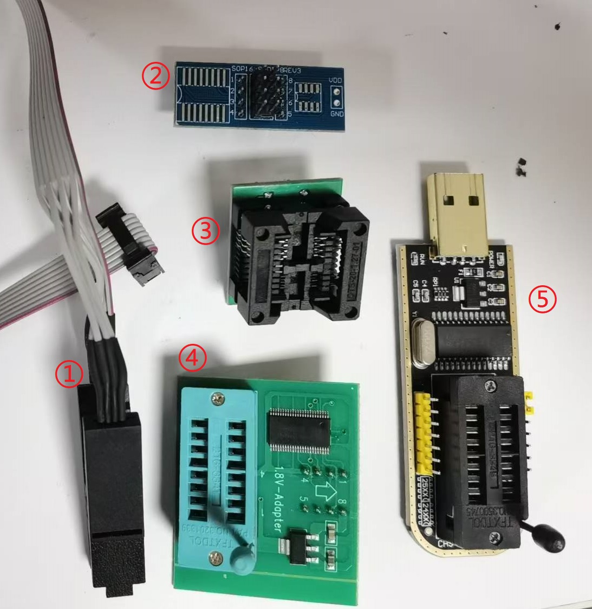

1. 烧写夹子：用于夹住 flash 芯片的 8 个输入输出引脚，然后进行读写操作。对于焊接在电路板上的 flash 芯片，很多时候只能用夹子夹住裸露的引脚进行烧写。夹子的 8 根线中有一根的塑料层是红色的，对应的就是 flash 芯片的 1 号引脚。
2. SOP16/8-DIP8REV3：蓝色小板子，可以配合烧写夹子使用，烧写夹子下端的孔插在蓝色板子的引脚中，进而接到其他的烧写工具上。此外，蓝色板子左侧有 16 个锡片，右侧有 8 个锡片，可以将 16 脚或者 8 脚的芯片引脚用锡焊接在锡片上，然后进行输入输出
3. SOP8 200mil 底座：可以将 8 引脚的 flash 芯片卡在基座的卡槽中进行烧写，比烧写夹子和 SOP16/8-DIP8REV3 方便很多，还不容易损坏 flash 芯片。
4. 1.8V 转换器：可以将 3.3V/5.0V 的烧写电压转换为 1.8V，适用于 1.8V 的芯片烧写
5. CH341A 编程器：上述主要都是信号传递设备，CH341A 是信号处理设备，使用 CH341A 端口协议进行数据传输，前 8 个引脚支持对 SPI 协议数据传输，后 8 个引脚支持对 I2C 协议数据传输。

本次实验烧写的对象是 W25Q128JWSIQ flash 芯片。该芯片使用 SPI 传输协议、8 引脚、1.8V 电压、16MB 存储容量、芯片可以拆卸。在芯片的一角有一个小圆点（光线太暗是看不清的，需要强光照射），对应的就是 SPI-FLASH 芯片的 1 号引脚的位置。
因此我们可以使用烧写基座、1.8V 电压转换器、CH341A 编程器进行烧写，无须适用烧写夹子和蓝色板子。现在我们介绍如何将这些部件连接起来，对 flash 进行烧写。

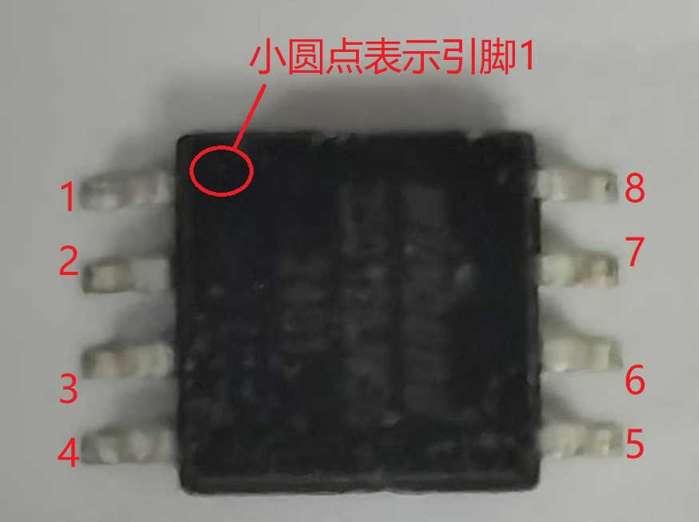

1. 首先按压基座的上层，下压弹簧，内部的弹簧会让中间凹槽两侧的铜片引脚打开，留出放置 flash 芯片的位置。需要注意的是，基座一共有 16 个可以卡住 flash 芯片的槽，但是只有 8 个有铜片是可以使用的；当我们下压上层塑料的时候，如果只是将没有铜片一侧的塑料压到底，因为塑料有一定的弹性，有铜片一侧的塑料也许没有完全压倒底，这会导致铜片引脚没有完全打开，flash 芯片会放不下去。

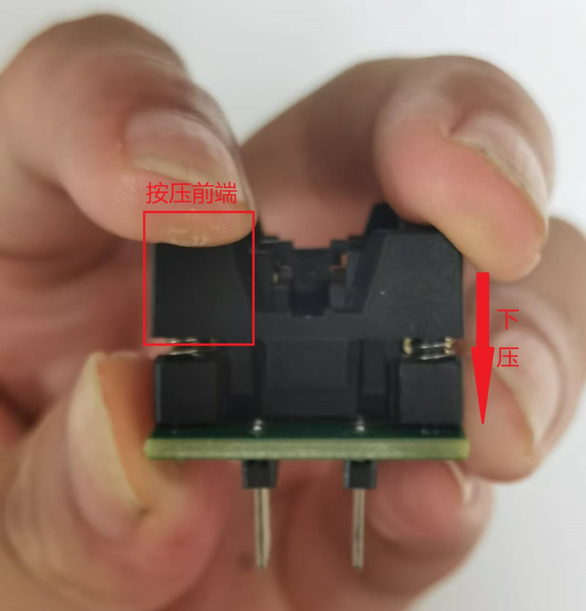

2. 然后将 SPI-FLASH 芯片放到基座对应的凹槽中。如果塑料被压到底，铜片被完全打开，这个凹槽是可以刚好将芯片放入，没有任何阻碍的；如果发生了阻碍请检查是不是弹簧没有压到底，或者部件存在轻微变形。如果芯片存在卡住的情况，请不要用力掰扯，会导致 flash 引脚被拗断（本人拗断了 2 块的引脚）；另外芯片只有半个指甲盖那么大，所以请使用镊子方便芯片的拾取和放置。

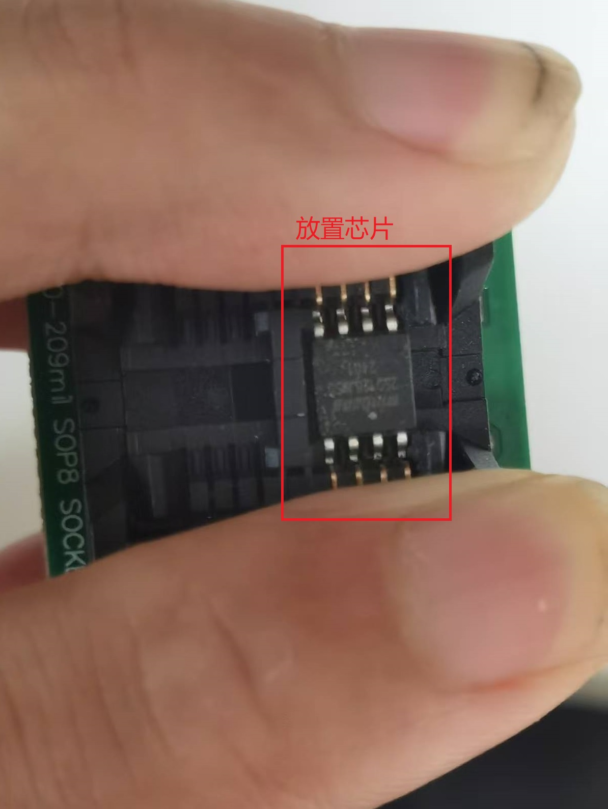

3. 之后将手指放开，弹簧弹起，铜片下压，正好将 SPI-FLASH 的 8 个引脚压在铜片底下。如果要拿出芯片，就将上层塑料下压，然后用镊子夹出即可。

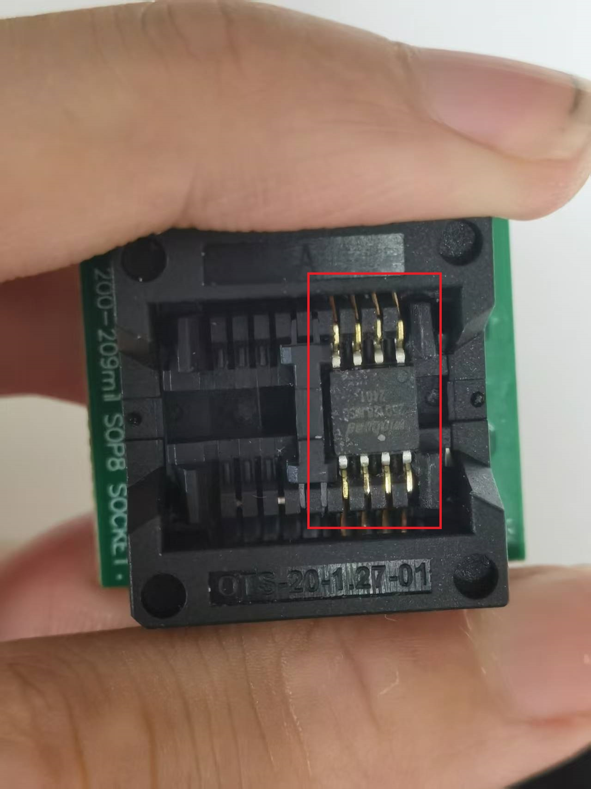

4. 将基座的 8 个引脚插入 1.8V 转换器的卡槽。1.8V 转换器的一侧标注了 1-4 号引脚的位置，请确保 SPI-FLASH 芯片的 1 号引脚位置和 1.8V 转换器相对应。然后拉下拉杆，将基座的 8 根引脚夹紧。

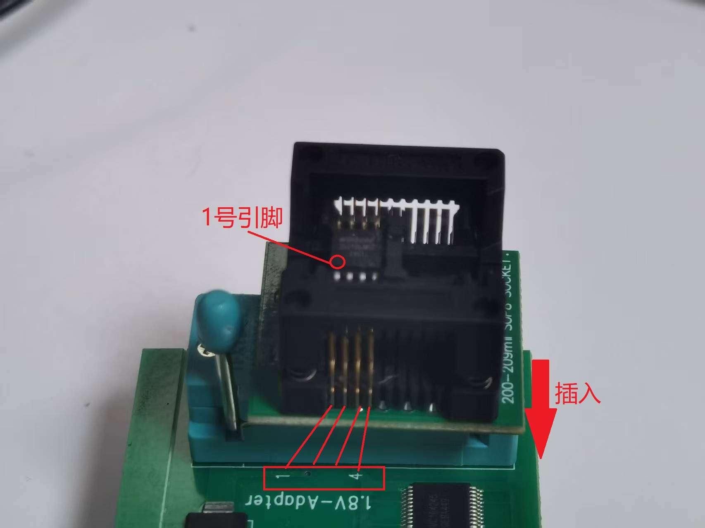

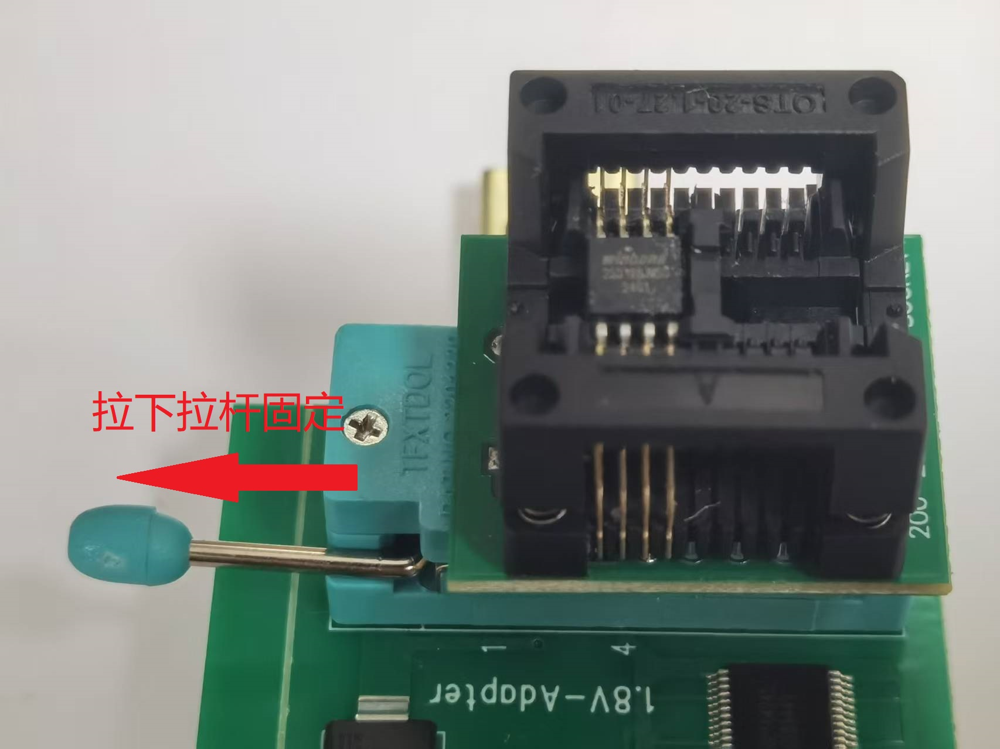

5. CH341A 编程器拉杆一侧是引脚 1-4 的位置，靠 USB 一侧的凹槽支持 SPI 传输协议，靠拉杆一侧的凹槽支持 I2C 协议，因此我们的 1.8V 转换器应该插在前 8 个凹槽中。插入之后，拉下拉杆即可。

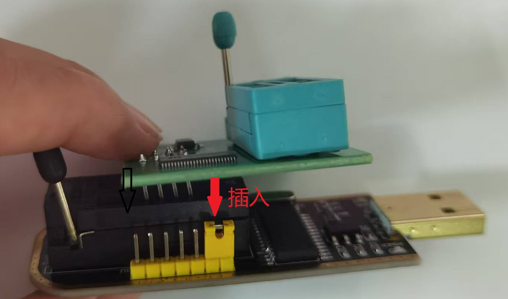

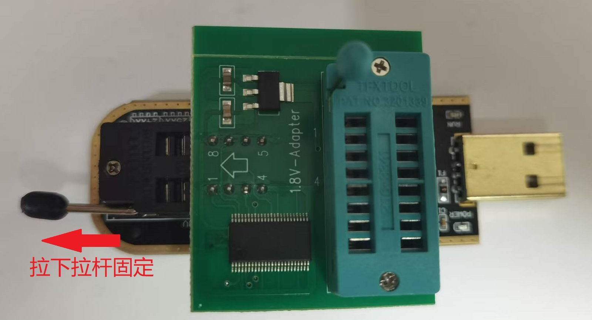

6. 最后将 CH341A 编程器的 USB 口插入电脑进行烧写即可，如果插入小灯会变亮，如果芯片识别成功，小灯亮度会提高一倍。

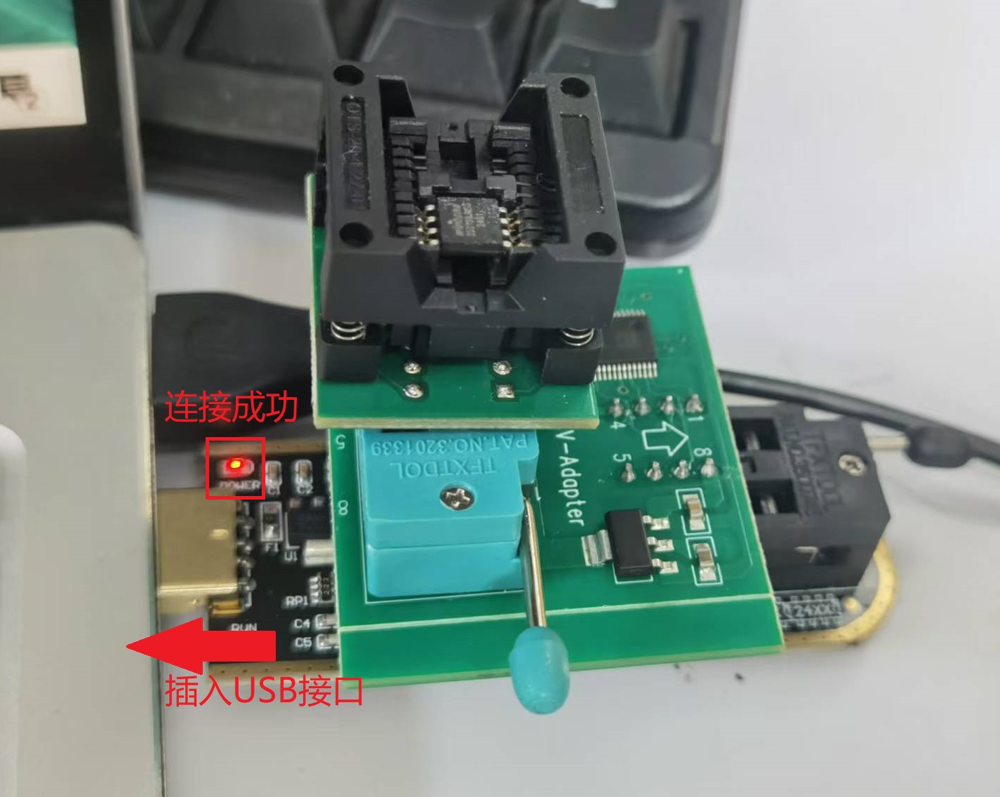

现在我们进行烧写的驱动配置和软件教学，该方法只适用于 windows 平台。

1. 我们进入 CH341A 驱动的官网 ``https://www.wch.cn/downloads/CH341SER_EXE.html`` 下载 CH341A 编程器的驱动。

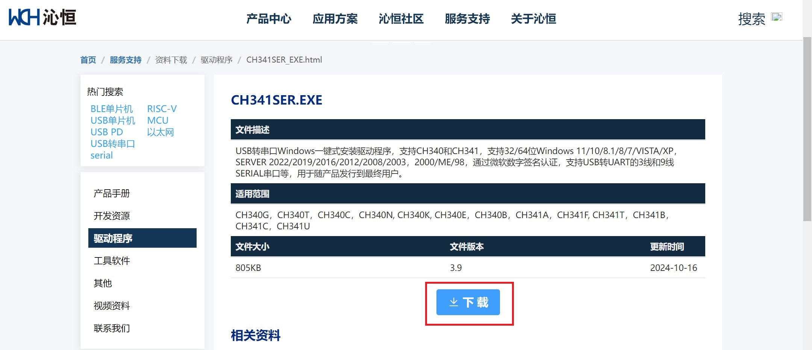

2. 点击驱动安装程序 CH341SER，然后点击“安装”，安装完毕后会显示“驱动预安装成功”。这个时候驱动还没有安装完毕。

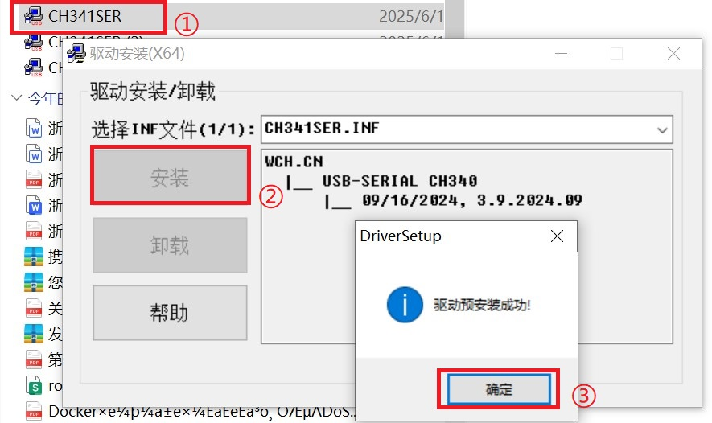

3. 之后打开“设备管理器”，可以看到 COM/PLT 下 CH341 的设备无法被识别，这个时候右键选择”更新驱动程序(P)“，然后选择”浏览我的电脑以查找驱动程序(R)“，然后选择”让我从计算机上的可用程序列表中选取(L)“。在列表的最后就可以看到 CH341SER 预安装的驱动，点击选择对应的 CH341A 驱动即可。之后就可以看到设备被识别出来了。
4. 之后打开 NeoProgrammer 软件的可执行程序，选择“检测”，然后可以识别到我们的 FLASH 芯片，选中即可。如果这个时候出现识别失败有多种可能的原因：

  1. CH341A 驱动没有安装成功
  2. 烧写部件之间没有紧密连接，接触不良等
  3. 基座的铜片和 FLASH 芯片引脚接触不良等

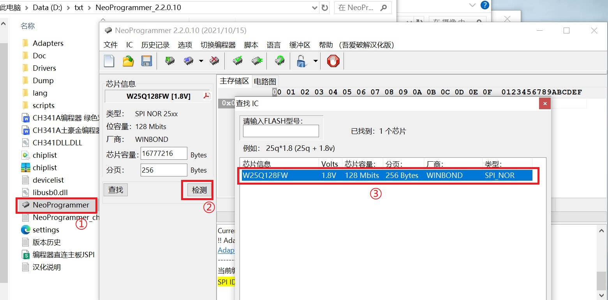

5. 选择“打开”，然后选中我们需要写入的镜像文件（上一章节编译得到的 binary）打开即可写入 NeoProgrammer 缓冲区

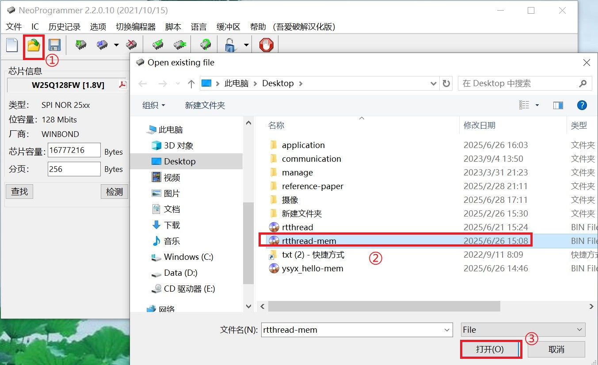

6. 点击“写入”的配置部分进行功能配置。最稳妥的情况下选择所有的选项，这样烧写的时候会先后作查空-清空-写入-校验，检查写入是否正确，但是前后需要 6 min，非常慢；也可以只勾选“写入/编程”，直接写入就很快。

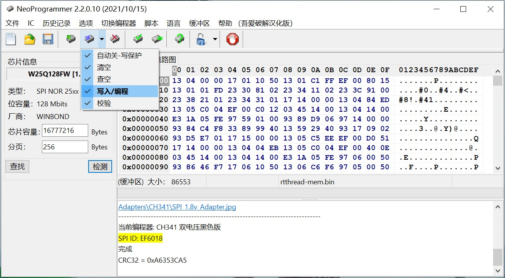

平台的使用
---------------------

现在我们正式将烧写完毕的 flash 在平台上进行执行。我们对平台进行介绍：

平台正面各个部件的功能如下：

* 电源开关：整个平台的电源总开关，打开才能工作
* 总复位按钮：对整个平台进行异步复位，包括处理器、FPGA 芯片等
* fpga 复位按钮：只对 fpga 芯片部分进行复位
* 串口 typec 接口：用于 typec 数据线连接充当串口
* ZJVSec 芯片：充当平台中央处理器
* flash 芯片槽：用于放置 flash 芯片，盖上盖子之后才可以使用 flash
* 模式开关：用于设置平台的工作模式，反正有点复杂

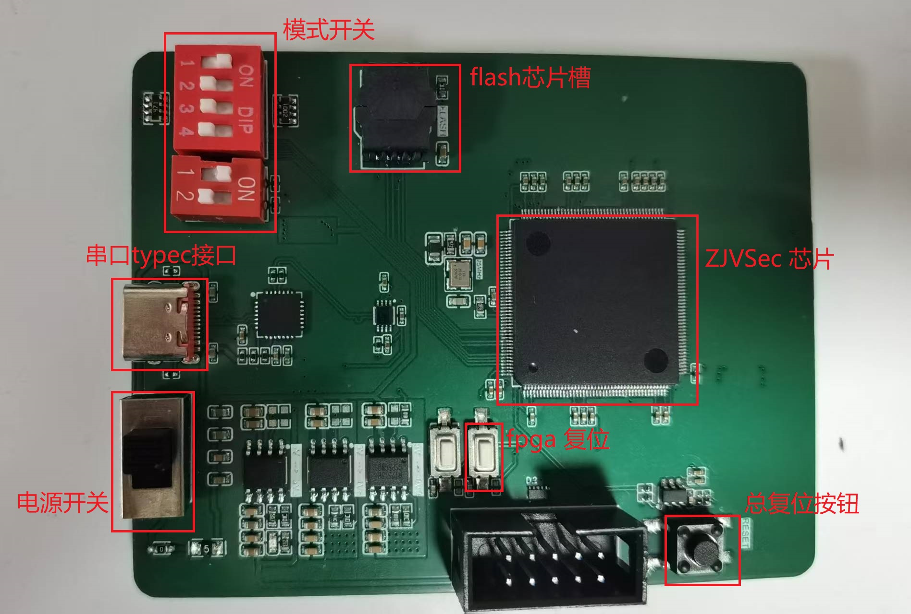

平台背面各个部件的功能如下：

* DDR 芯片：充当平台内存条，大小 64 MB
* FPGA 芯片：充当 MIG DDR 接口，和正面平台总线相连

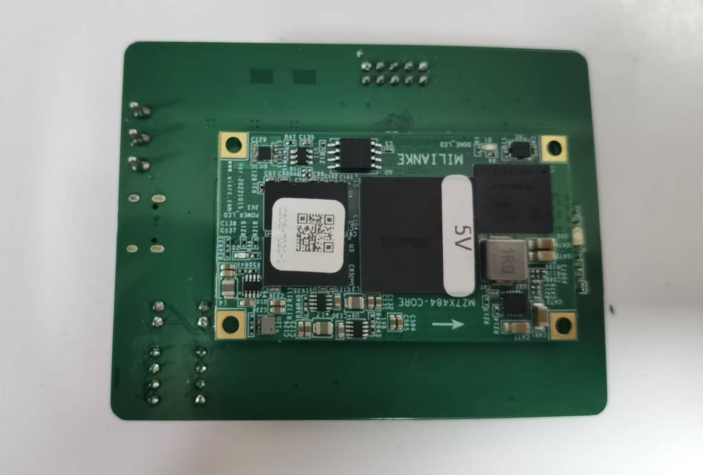

之后我们连接和启用平台：

1. 将模式开关的 4 个按钮设置为 1000
2. 将模式按钮的 2 个按钮设置为 10
3. 用镊子将 FLASH 芯片放入 FLASH 槽，1 号引脚对应图片的右上脚。如果方向反了，上电后 flash 指示灯不会亮起
4. 用 USB-typec 数据线连接 pc 和平台
5. 打开电源开关
6. 红灯亮起，平台工作正常
7. 背面蓝灯亮起，flash 工作正常

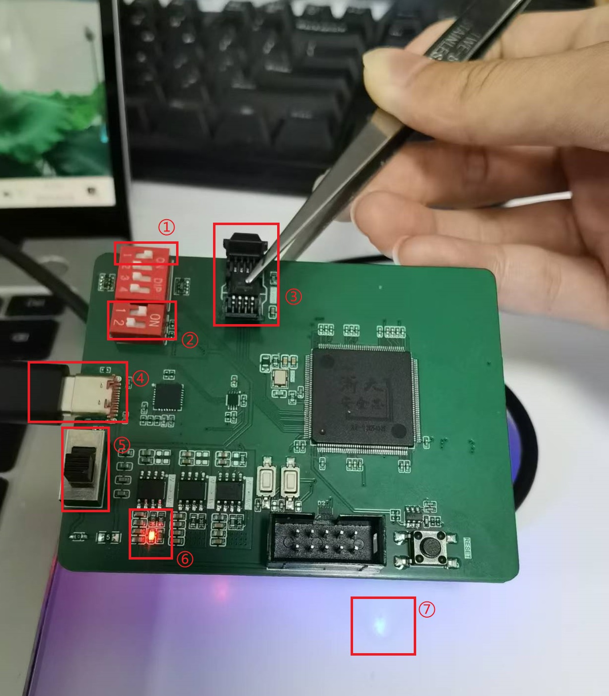

最后我们用串口助手（这里使用 mobaxterm）查看串口输出情况，下面分别是 hello 和 rtthread 的输出：

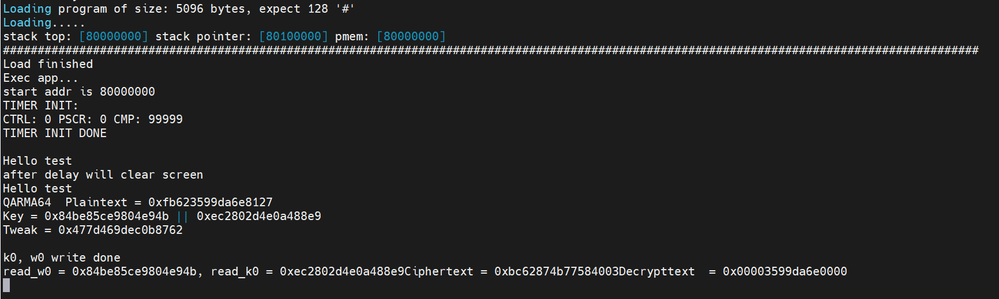

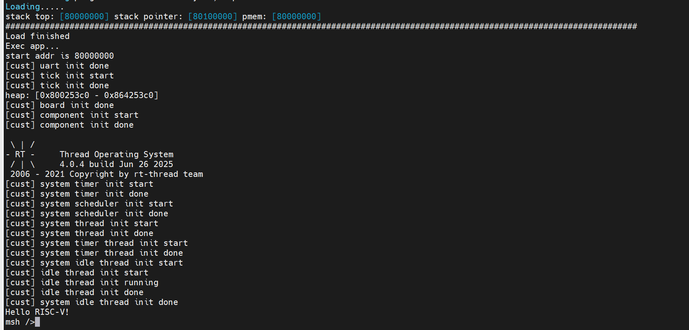

输出的时候可能存在输出错位的问题，这是因为平台编程的时候软件用的是 ``\n`` 而不是 ``\n\r``。因此可以右键 mobaxterm 的串口界面，设置 terminal 自动插入 
``\r``。